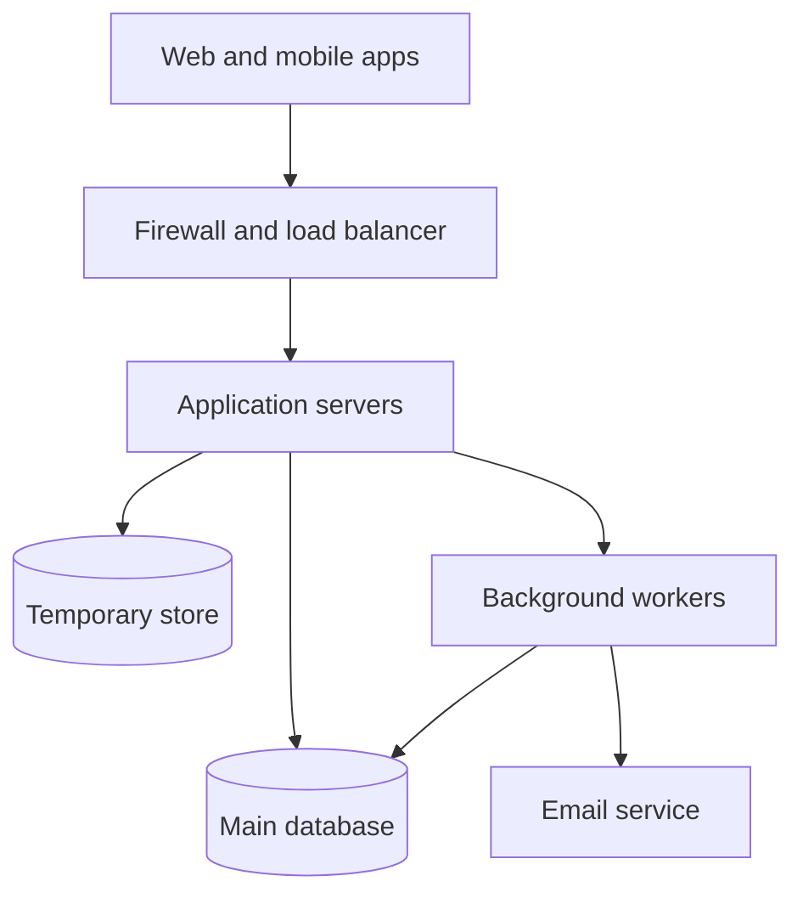

# Task Management Platform — Architecture & Technical Design

Backend design for a task manager: people register, keep their own tasks, and an administrator can look across accounts. This repository is the design. There is no application code in it. Less common abbreviations are in the [glossary](docs/GLOSSARY.md).

---

## The Problem

Design a backend for a task management platform supporting user registration and authentication, two principal types (regular users and administrators), full task lifecycle management, users acting only on their own tasks, administrators acting across all users, and secured application programming interfaces (APIs) throughout.

The technology, architecture and structure were entirely open. Every choice here is justified rather than assumed.

---

## The Design in One Page

A **modular monolith** in Python (FastAPI) running as stateless replicas behind a load balancer, backed by a single **PostgreSQL** instance as the system of record, with **Redis** for rate limiting and queueing, and a separate worker process for asynchronous work.

Authentication uses **short-lived JSON Web Token (JWT) access tokens** (15 minutes, signed with the Edwards-curve Digital Signature Algorithm (EdDSA), no server state) paired with **opaque refresh tokens** (30 days, rotated on every use, with reuse detection that revokes the entire token family). Passwords are hashed with **Argon2id**.

Authorization is the design's centre of gravity.

In a system whose entire security model is "users see their own tasks, administrators see everything", **broken object-level authorization is the dominant risk** — it is the top item on the Open Worldwide Application Security Project (OWASP) list of application risks. It produces no error when it fails, and no outer firewall catches it.

The response is four independent layers:

1. A **single policy engine** that raises rather than returning a boolean, so a forgotten result cannot silently grant access.
2. **Query-level scoping** — `WHERE owner_id = :principal_id` is applied in the repository, so a missing check returns *nothing* rather than *someone else's data*. The system fails closed by construction.
3. A **separate `/admin` namespace** that is privileged-by-default, so the privilege boundary is never inside a function that also serves unprivileged traffic.
4. A **generated authorization test matrix** covering every actor × resource × endpoint combination, plus mutation testing, as a merge gate.

Every state change writes an **audit record in the same transaction** as the change itself, to an append-only table the application cannot modify. A **correlation ID** minted at the edge appears on every log line, span, audit row, and error response body — so a user can paste one string into a support ticket and an engineer can reconstruct the entire request.

---

## Architecture at a Glance

Full version with every component: [diagrams/01-high-level-architecture.md](docs/diagrams/01-high-level-architecture.md).

---

## Documentation Map

Read in this order for a complete picture, or jump to what you need.

| # | Document | Covers | Read if you want |
|---|---|---|---|
| 1 | **[High-Level Design (HLD)](docs/HLD.md)** | Components, layers, sizing assumptions, service level objectives (SLOs), architecture style, non-goals | The overall shape and why it is this shape |
| 2 | **[System Design](docs/SYSTEM_DESIGN.md)** | Registration, authentication, refresh, list, create, update, delete, admin access — with sequence diagrams | How each flow actually works, including failure paths |
| 3 | **[API Design](docs/API_DESIGN.md)** | All endpoints, request/response shapes, error model, status-code policy, rate limits, versioning | The contract a client would build against |
| 4 | **[Security](docs/SECURITY.md)** | Threat model, defence in depth, tokens, authorization, validation, secrets, OWASP coverage | The security reasoning and the gaps I am carrying |
| 5 | **[Data Architecture](docs/DATA_ARCHITECTURE.md)** | Entities, constraints, indexes, transaction boundaries, consistency, lifecycle, migrations | The schema and the integrity guarantees |
| 6 | **[Scalability](docs/SCALABILITY.md)** | Staged evolution with numeric triggers, database scaling, caching, queueing, spikes | What I would add, when, and what I would refuse to add |
| 7 | **[Availability](docs/AVAILABILITY.md)** | single point of failure (SPOF) analysis, failure modes, degraded mode, timeouts, retries, recovery | How the system behaves when things break |
| 8 | **[Observability](docs/OBSERVABILITY.md)** | Logging, metrics, tracing, audit, alerting, and a worked investigation walkthrough | How you debug a failed or slow request |
| 9 | **[Code Structure](docs/CODE_STRUCTURE.md)** | Package layout, layer responsibilities, composition root, conventions | How the Python application would be organised |
| 10 | **[Development Practices](docs/DEVELOPMENT_PRACTICES.md)** | Separation of concerns, error handling, config, dependencies, review, git, continuous integration and continuous delivery (CI/CD) | How the team would work |
| 11 | **[Testing Strategy](docs/TESTING_STRATEGY.md)** | Unit, integration, API, security, load — and the authorization matrix | What gets tested and why |
| 12 | **[Risks & Trade-offs](docs/RISKS_AND_TRADEOFFS.md)** | Assumptions, risk register, bottlenecks, and every trade-off accepted | The honest limitations |
| — | **[Decision Log](DECISION_LOG.md)** | 25 significant decisions with alternatives and costs | Why any particular choice was made |
| — | **[Diagrams](docs/diagrams/)** | The four required diagrams, each split so the boxes stay readable | A visual route into the design |
| — | **[Glossary](docs/GLOSSARY.md)** | Full names for every short form | A plain-language lookup |

## How to read the high-level design

Start here, then open [docs/HLD.md](docs/HLD.md).

Section 2 is the load I sized for. Section 3 is why I kept this as one service. Section 4 is the picture. Section 14 is the list of things I left out, and the condition that would make me add each one.

If you have time for two more pages, read [how an administrator opens someone else's task](docs/SYSTEM_DESIGN.md#8-administrator-accessing-another-users-task) and the [trade-offs](docs/RISKS_AND_TRADEOFFS.md#6-principal-trade-offs).

## Key decisions

The full list, with the options I rejected, is in [DECISION_LOG.md](DECISION_LOG.md). The ones that shape everything else:

- One deployable Python service, not a set of microservices.
- PostgreSQL as the only system of record.
- A short-lived signed access token, plus a rotating refresh token we can revoke.
- Permission checks in one place, and a separate `/admin` area.
- No cache in front of a person's task list at launch.

---

## Technology Choices

| Layer | Choice | Why — full reasoning in the [Decision Log](DECISION_LOG.md) |
|---|---|---|
| Language | Python 3.12 | Specified by the assessment |
| Framework | FastAPI + Pydantic v2 | Validation at the boundary is a security control; OpenAPI generated from code cannot drift; native async for an I/O-bound workload |
| Database | PostgreSQL 16 | The core invariant and the dominant query are both relational; every write needs multi-row atomicity; constraints are the only validation that cannot be bypassed |
| ORM | SQLAlchemy 2.0 async + Alembic | Mature, and it does not force the domain model to look like the tables |
| Cache/queue | Redis + arq | Already required for rate limiting; adding a second broker for four low-volume job types would be unearned complexity |
| Auth | Argon2id, EdDSA JWT, rotating opaque refresh tokens | Memory-hard hashing; asymmetric signing limits blast radius; rotation makes token theft detectable |
| Compute | Elastic Container Service (ECS) Fargate | Kubernetes is a platform to operate, and a 2–4 person team cannot amortise that cost |
| Observability | OpenTelemetry, structlog, Prometheus | Vendor-neutral, one vocabulary across logs, metrics and traces |
| Diagrams | Mermaid in Markdown | Image-based diagrams drift within weeks; text diagrams are reviewed with the change they describe |

---

## Key Assumptions

Full list with impact analysis in [Risks & Trade-offs section 1](docs/RISKS_AND_TRADEOFFS.md#1-assumptions). The five that carry the most weight:

| | Assumption | If wrong |
|---|---|---|
| A1 | **A task has exactly one owner.** No sharing, no teams | The authorization model changes from ownership to ACLs. **The largest latent change in the design** |
| A2 | Two roles are sufficient | The policy engine needs a permission model rather than a role map |
| A3 | 50k users, 5k daily active users (DAU), 150 req/s peak, 2M tasks in year one | The launch topology; Stages 1–2 of the evolution path absorb 10× |
| A4 | Single region is acceptable | Availability and disaster-recovery design |
| A5 | Tasks contain ordinary business text, not regulated data | Encryption and compliance posture |

---

## Risks and Limitations

The three I would actually lose sleep over, from the [risk register](docs/RISKS_AND_TRADEOFFS.md#2-risk-register):

**Broken object-level authorization.** Medium likelihood — it is an easy mistake, one endpoint, one forgotten check. Critical impact. Hardest to detect, because a successful exploit looks like a normal `200`. Four layers of mitigation plus generated tests plus mutation testing plus a two-reviewer rule, and a penetration test scoped at authorization boundaries before general availability.

**Credential stuffing.** High likelihood, because it needs no skill — the lists are commodity and the attack is automated. Argon2id, breach-corpus rejection and dual-axis rate limiting help, but **the honest fix is multi-factor authentication (MFA)**, which I deferred and would make mandatory for administrators before general availability. That is a decision, not an oversight.

**Database connection exhaustion.** The bottleneck that arrives *because* you scaled out, so the instinctive response of adding replicas makes it worse. Every dashboard stays green — central processing unit (CPU) low, queries fast — while requests queue for a connection. It gets a dedicated metric and alert from day one for exactly that reason.

**Accepted limitations:** a single region means hours of downtime in a regional failure; a 60–120 second write-unavailability window during database failover, during which reads continue in degraded mode; no multi-factor authentication in the first version; rate limiting and the token denylist fail open if Redis is unavailable, because failing closed would turn a cache outage into a total outage.

---

## Future Considerations

In priority order, with reasoning in [Risks & Trade-offs section 7](docs/RISKS_AND_TRADEOFFS.md#7-what-i-would-do-next):

1. **MFA, mandatory for administrators** — the largest open security gap.
2. **Penetration test scoped at authorization** — verifies the primary risk against someone who was not involved in the design.
3. **Load test with production-shaped data** — confirms the predicted bottleneck is the real one. If it is not, the scaling plan is aimed at the wrong thing.
4. **A timed point-in-time-recovery drill** — an untested backup is a hypothesis.
5. Behavioural anomaly detection, a second email provider, and confirming or rejecting the task-sharing requirement before the ownership model calcifies.

Items 1–4 are verification rather than construction. At this stage that is the right emphasis: the design's claims are worth only what can be demonstrated, and now is the cheapest time to discover that one of them is wrong.

---

## A Note on Scope

The assessment asks for quality of technical thinking over volume of documentation, and warns against adding infrastructure for its own sake. I took both seriously.

That is why the design is a monolith rather than microservices, why there is no Kubernetes, no command and query separation (CQRS), no event sourcing, no GraphQL, and no caching of task data — and why each of those omissions has a stated reason and a **numeric trigger** that would change the answer. [HLD section 14](docs/HLD.md#14-deliberate-non-goals) lists what was deliberately excluded; [Scalability section 2](docs/SCALABILITY.md#2-the-evolution-path) gives the measured signal that would justify each addition.

Deciding those thresholds in advance is the part that matters. It turns "we don't need that yet" from a guess into a defensible engineering position, and it stops scaling decisions from being made reactively during an incident.
