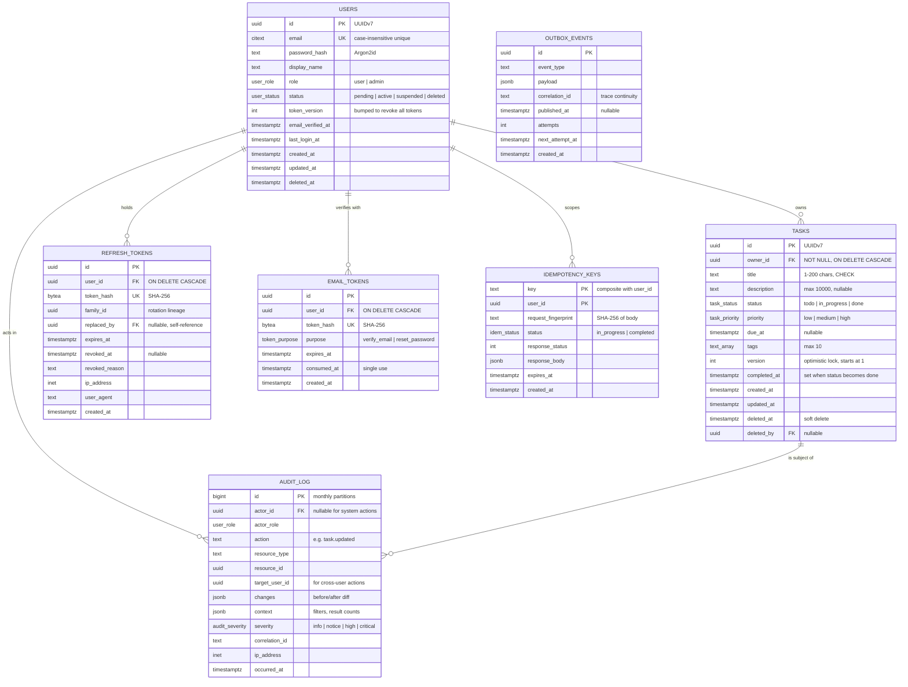

# Data Architecture

## 1. Technology Choice: PostgreSQL 16

**Decision: a single relational database as the system of record.**

The reasoning is specific to this workload rather than general preference:

1. **The core invariant is relational.** "A task belongs to exactly one user, and only that user or an administrator may touch it" is a foreign key plus an ownership predicate. A relational engine enforces this in the storage layer; a document store would push referential integrity into application code — the one place I am least willing to put it, because here it *is* the security boundary.
2. **The access pattern is relational.** Filter by owner, status and date; sort; paginate. Composite B-tree indexes serve this exactly.
3. **Multi-entity atomicity is required on every write.** A task mutation, its audit record, and its outbox event must commit or fail together. Without real transactions this becomes a distributed-consistency problem in a system that has no reason to have one.
4. **The data volume is not a challenge.** 50 million rows is a comfortable single-instance workload for PostgreSQL on modern hardware. Choosing a distributed store here would be solving a problem we do not have while acquiring several we would.

### Alternatives considered

| Option | Why not |
|---|---|
| MongoDB | The flexible schema is a liability when the schema is well known and stability is the goal. Referential integrity and cross-document transactions would move to application code |
| DynamoDB | Excellent at known single-key access patterns, hostile to the ad-hoc multi-field filtering admins need. Would require several GSIs and still not answer arbitrary queries. Also the deepest cloud lock-in available |
| MySQL | A genuinely reasonable choice. PostgreSQL wins on richer types (`JSONB`, arrays, `citext`), partial and expression indexes, `EXCLUDE` constraints, transactional DDL, and stronger default isolation semantics |
| PostgreSQL + a separate document store | Two consistency models and two operational surfaces for no requirement that demands it |

`JSONB` columns are used narrowly — audit diffs and outbox payloads — where the shape is genuinely variable. Business fields that are queried or constrained are real columns. `JSONB` for core entity data would mean losing constraints, type safety and index quality in exchange for a schema flexibility that stable domain entities do not need.

---

## 2. Entity Relationship Model



---

## 3. Schema Decisions That Matter

### Primary keys: UUIDv7

Not sequential integers, not UUIDv4.

Sequential integers are enumerable. `GET /tasks/1001` after `GET /tasks/1000` turns any authorization gap into a complete data dump, and exposes business volume to anyone who registers. UUIDv4 fixes enumerability but is random, so index inserts scatter across the B-tree, causing page splits, write amplification and index bloat on a high-insert table.

UUIDv7 embeds a millisecond timestamp in its high bits, so values are time-ordered. Inserts append to the right-hand edge of the index like an integer, while remaining non-enumerable. It also makes `ORDER BY id` a valid creation-order sort and gives the keyset-pagination tiebreaker a natural ordering.

The cost is 16 bytes rather than 8 and a slightly less readable ID in a URL. Both are acceptable; the enumeration property is not negotiable given that object-level authorization is the system's primary risk.

### Email: `citext` with a normalising constraint

Email is case-insensitive in practice. Storing it as `text` with a unique index means `Ada@example.com` and `ada@example.com` are two accounts — an account-takeover confusion vector, not merely a nuisance. `citext` makes the uniqueness constraint match reality. Input is also normalised to lowercase at the boundary, so the constraint and the application agree.

### Status and role as native enums

PostgreSQL `ENUM` types rather than `TEXT` with a `CHECK`, or a lookup table. The database rejects an invalid status even if application code has a bug or someone runs a manual `UPDATE`. Enums are compact and indexable. The cost is that adding a value requires `ALTER TYPE ... ADD VALUE`, which is a migration — appropriate friction for changing a domain concept, and non-blocking in PostgreSQL 12+.

### Soft delete on tasks only

`tasks` and `users` carry `deleted_at`; `refresh_tokens` and `email_tokens` are hard-deleted. The distinction is intentional: credentials should not linger after revocation, whereas user content should be recoverable. Every read path filters `deleted_at IS NULL`, and a partial index makes that filter free.

**The trap this creates:** any unique constraint over soft-deletable rows must be partial. Without `WHERE deleted_at IS NULL`, a deleted task permanently blocks re-creating one with the same title — a bug that appears weeks after launch and confuses everyone.

### Optimistic concurrency via `version`

An integer incremented on every update, surfaced as an HTTP `ETag`, checked by `UPDATE ... WHERE id = :id AND version = :expected`. A zero-row result means a concurrent writer won. See [System Design §6](SYSTEM_DESIGN.md#6-updating-a-task).

### Tags as a `TEXT[]` column

A normalised `task_tags` join table is the textbook answer, and here it would be over-normalisation: tags are a bounded list of at most ten short strings, always read with their task and never queried independently. A `TEXT[]` with a GIN index handles containment queries efficiently and avoids a join on the hottest read path. If tags ever acquire their own identity — colours, per-user tag management, renaming — normalisation becomes correct, and that is a contained migration.

---

## 4. Constraints

Constraints live in the database because application-level validation is bypassed by migrations, bulk jobs, manual fixes and bugs. The database is the last line that never gets skipped.

| Constraint | Type | Purpose |
|---|---|---|
| `users.email` unique | `UNIQUE` on `citext` | One account per address, case-insensitively |
| `tasks.owner_id → users.id` | `FOREIGN KEY ... ON DELETE CASCADE` | No orphaned tasks; account deletion removes content |
| `tasks.title` non-empty | `CHECK (length(btrim(title)) BETWEEN 1 AND 200)` | Whitespace-only titles are not valid |
| `tasks.description` length | `CHECK (length(description) <= 10000)` | Bounds row size |
| `tasks.version` positive | `CHECK (version >= 1)` | Guards the locking invariant |
| `tasks.completed_at` coherence | `CHECK ((status = 'done') = (completed_at IS NOT NULL))` | The timestamp cannot contradict the status |
| `tasks.tags` bounded | `CHECK (array_length(tags, 1) <= 10)` | Prevents unbounded growth |
| `refresh_tokens.token_hash` unique | `UNIQUE` | No hash collisions or duplicate rows |
| At least one admin | Trigger or `EXCLUDE`-backed guard | The organisation cannot lock itself out |
| `audit_log` append-only | Role privileges: `INSERT`, `SELECT` only | The application cannot rewrite history |
| `idempotency_keys` unique | `PRIMARY KEY (user_id, key)` | The database, not application logic, arbitrates concurrent duplicates |

**The "at least one admin" constraint is worth highlighting.** Enforcing it only in application code means one bad migration, one bulk script, or one race between two concurrent demotions locks every administrator out of the system permanently, with recovery requiring direct database access. Enforcing it in the database makes that outcome impossible.

---

## 5. Indexing Strategy

Indexes are designed against actual query shapes. Each one below exists because a specific query needs it.

| Index | Definition | Serves |
|---|---|---|
| `users_email_key` | `UNIQUE (email)` | Login lookup; uniqueness |
| `ix_users_status` | `(status) WHERE status != 'active'` | Small partial index for admin filtering; the common case needs no index |
| **`ix_tasks_owner_created`** | `(owner_id, created_at DESC, id DESC) WHERE deleted_at IS NULL` | **The primary read path.** Serves `GET /tasks` and its keyset pagination directly |
| `ix_tasks_owner_status` | `(owner_id, status, created_at DESC) WHERE deleted_at IS NULL` | Status-filtered lists, the most common filter |
| `ix_tasks_owner_due` | `(owner_id, due_at) WHERE deleted_at IS NULL AND due_at IS NOT NULL` | "Due soon" views; partial, since most tasks have no due date |
| `ix_tasks_deleted_at` | `(deleted_at) WHERE deleted_at IS NOT NULL` | The purge job; tiny, because it indexes only deleted rows |
| `ix_tasks_tags` | `GIN (tags)` | Tag containment |
| `ix_tasks_title_trgm` | `GIN (title gin_trgm_ops)` | Substring search; added only when `q` usage justifies it |
| `ix_refresh_tokens_hash` | `UNIQUE (token_hash)` | Refresh lookup |
| `ix_refresh_tokens_family` | `(family_id) WHERE revoked_at IS NULL` | Family revocation on reuse detection |
| `ix_audit_resource` | `(resource_type, resource_id, occurred_at DESC)` | "What happened to this task?" |
| `ix_audit_actor` | `(actor_id, occurred_at DESC)` | "What did this user do?" |
| `ix_audit_severity` | `(severity, occurred_at DESC) WHERE severity IN ('high','critical')` | Security review; partial, so it stays small |
| `ix_outbox_unpublished` | `(next_attempt_at) WHERE published_at IS NULL` | Dispatcher poll; stays tiny because published rows leave the index |

### Principles applied

**Column order follows the equality-then-range-then-sort rule.** `(owner_id, created_at DESC, id DESC)` puts the equality predicate first so the index seeks straight to one user's slice, then reads in sort order. The reverse order would be nearly useless.

**Partial indexes wherever a predicate is always present.** `WHERE deleted_at IS NULL` is on every user-facing query, so including it in the index keeps deleted rows out of the index entirely — smaller, faster, cheaper to maintain.

**Indexes are not free.** Each one slows writes and consumes memory that would otherwise cache data pages. The set above is deliberately small: every index is justified by a named query, and `pg_stat_user_indexes` is reviewed quarterly so unused indexes are dropped. Speculative indexing is a real cost paid for an imagined benefit.

**`ix_tasks_title_trgm` is explicitly deferred.** Trigram indexes are large and write-expensive. It ships only if search usage justifies it, which is a measurement, not a guess.

---

## 6. Transaction Boundaries

**One transaction per use case, opened and committed by the application service.** Neither the API layer nor the repository layer commits. This single rule prevents the most common data-integrity failure in layered applications: a repository that commits per call, leaving a use case half-applied when a later step fails.

```python
# Illustrative — the shape of the unit of work.

async def update_task(self, principal, task_id, changes, if_match):
    async with self.uow:                                  # BEGIN
        task = await self.uow.tasks.get_for_update(task_id)
        if task is None:
            raise NotFound()
        self.policy.authorize(principal, "task:update", task)
        if if_match is not None and if_match != task.version:
            raise PreconditionFailed(current=task)

        before = task.snapshot()
        task.apply(changes)                               # domain invariants
        await self.uow.tasks.save(task)                   # WHERE version = expected
        await self.uow.audit.record("task.updated", diff(before, task))
        await self.uow.outbox.add(TaskUpdated(task.id))
        # COMMIT on clean exit, ROLLBACK on any exception
    return task
```

### What is inside each boundary

| Use case | Inside the transaction | Outside |
|---|---|---|
| Register | User insert, verification token, audit, outbox | Email delivery, breach-corpus lookup |
| Login | Refresh token insert, `last_login_at`, audit | Password verification (CPU-bound, no lock held), rate-limit counters |
| Create task | Idempotency key, task insert, audit, outbox | Response serialisation |
| Update task | Load, authorize, version-guarded update, audit, outbox | — |
| Delete task | Soft-delete update, audit, outbox | Purge, which is a separate transaction later |
| Admin read | Audit insert | The read itself, which needs no transaction |

### Deliberate exclusions

**Argon2id verification happens outside the transaction.** It takes ~200 ms. Holding a database connection and any locks for that duration would exhaust the connection pool under a login burst — the exact moment the system is under attack and most needs to stay up.

**External calls are never inside a transaction.** A 3-second email timeout inside an open transaction holds a connection for 3 seconds. Under load that is how a third-party slowdown becomes a database outage. The outbox pattern exists precisely to keep the network out of the commit path.

### Isolation level

`READ COMMITTED` — the PostgreSQL default — for all normal operations. The stronger anomalies that `REPEATABLE READ` prevents are not present in this workload, and the lost-update case that *is* present is handled precisely and cheaply by the `version` check, without the serialisation-failure retry loops that `SERIALIZABLE` would impose on every write.

`SERIALIZABLE` is used for one operation: the "last admin" demotion check, where a read-then-write race between two concurrent demotions could genuinely leave zero administrators. This is a rare operation where the cost of serialisation is irrelevant and the cost of the race is severe.

---

## 7. Data Consistency

### Strong consistency where it matters

All reads and writes go to the primary by default. A user who creates a task and immediately reloads their list must see it; read-your-own-writes is a correctness requirement in a task manager, not a nicety.

When read replicas are introduced ([Scalability §4](SCALABILITY.md#4-database-scaling)), routing is explicit rather than automatic:

| Query | Target | Why |
|---|---|---|
| Any write | Primary | Only option |
| A user's own task list | Primary | Read-your-writes |
| Authentication and authorization lookups | Primary | Stale permission data is a security bug, not a staleness bug |
| Admin analytics, reporting | Replica | Seconds of lag are irrelevant |
| Audit log queries | Replica | Historical by nature |

Replica routing is an explicit, per-query decision. Blanket "send all reads to a replica" routing is how read-your-writes bugs get shipped, and they are maddening to reproduce because they only manifest under replication lag.

### Eventual consistency where it is acceptable

Only three things are eventually consistent, each by choice: outbox event delivery (an email arrives seconds later), audit archival to object storage, and replica-served analytics. None affects a correctness or security decision.

### Integrity under concurrent operations

| Scenario | Mechanism |
|---|---|
| Two clients update the same task | `version` guard; the loser gets `409`, or `412` if it sent `If-Match` |
| Duplicate submission from a retry | `Idempotency-Key` with a unique constraint arbitrating the race |
| Two registrations for the same email | Unique constraint on `citext` email |
| Two concurrent admin demotions | `SERIALIZABLE` plus the database-level "at least one admin" guard |
| Task updated while being deleted | Both take the row lock; the second sees the outcome of the first |
| Outbox event dispatched twice | Consumers are idempotent; at-least-once is accepted |
| Refresh token used twice | Unique constraint plus reuse detection revokes the family |

The consistent pattern: **let the database arbitrate races through constraints, rather than trying to prevent them with application logic.** Application-level check-then-act is inherently racy; a unique constraint is not.

---

## 8. Data Lifecycle

| Data | Hot | Archive | Deletion |
|---|---|---|---|
| Active tasks | Indefinite | — | On user action |
| Soft-deleted tasks | 30 days | — | Hard-deleted by daily job |
| Users | Lifetime | — | Hard-deleted 30 days after an erasure request |
| Refresh tokens | Until expiry | — | Hourly cleanup |
| Email / reset tokens | 15 min – 24 h | — | Hourly cleanup |
| Idempotency keys | 24 hours | — | Hourly cleanup |
| Outbox events | Until published | 7 days | Daily cleanup |
| Audit log | 12 months | 7 years in object storage | Partition dropped after archival |

**`audit_log` is partitioned monthly by `occurred_at`.** It is the fastest-growing table and the one that is never updated — an ideal partitioning candidate. Archival becomes "copy one partition to object storage, then `DROP TABLE`", which is instant and reclaims space immediately, instead of a `DELETE` of millions of rows that bloats the table and triggers an expensive vacuum. Queries filtered by date prune to a single partition automatically.

---

## 9. Backup and Recovery

| Mechanism | Frequency | Retention | Purpose |
|---|---|---|---|
| Automated snapshots | Daily | 30 days | Routine restore |
| WAL archiving | Continuous | 7 days | Point-in-time recovery, ≤ 5 min RPO |
| Cross-region snapshot copy | Daily | 90 days | Regional disaster |
| Logical dump | Weekly | 90 days | Migration, and protection against physical-format corruption |

**Restore drills are quarterly and timed.** An untested backup is a hypothesis, not a control — and the failure mode of an untested backup is discovering the problem during an incident. The drill restores to a scratch instance, runs schema and row-count validation, and records the elapsed time against the 30-minute RTO.

The highest-value recovery scenario is not hardware failure — the Multi-AZ standby covers that automatically. It is **a bad migration or a buggy bulk job corrupting data at 14:03**, where PITR to 14:02 is the only option. That is what the WAL archive is for, and that is what the drill rehearses.

---

## 10. Migrations

Alembic, with migrations reviewed as carefully as application code.

Rules that prevent the classic outage: every migration is backward compatible with the currently running application version, because deployment is rolling and old and new code run simultaneously. Column drops and renames are therefore **expand–migrate–contract** across three releases — add the new column and dual-write, backfill in batches, then drop the old column once no running code references it.

Also mandatory: `CREATE INDEX CONCURRENTLY` on any populated table, since a plain `CREATE INDEX` takes an `ACCESS EXCLUSIVE` lock and stalls all writes; a `lock_timeout` on every migration so a blocked DDL statement fails fast instead of queueing behind a long query and blocking the entire table; batched backfills rather than a single `UPDATE` over millions of rows; and a tested down-path, or an explicit, documented decision that a given migration is forward-only.
