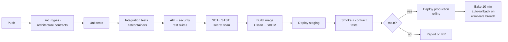

# Development Practices

The practices below are chosen on one criterion: **does this catch a class of defect automatically, or does it rely on someone remembering?** Anything that depends on vigilance will fail eventually, usually under deadline pressure. Every practice here is either enforced by a tool in CI or is a small number of explicit, reviewable rules.

---

## 1. Separation of Concerns

The layering is defined in [Code Structure §3](CODE_STRUCTURE.md#3-layer-responsibilities). Three rules, all machine-checked:

| Rule | Enforcement |
|---|---|
| The domain layer imports no framework or I/O | `import-linter` forbidden contract |
| Modules talk only through `interface.py` | `import-linter` layered contract |
| Routers never import repositories | `import-linter` |

```ini
# .importlinter — illustrative
[importlinter:contract:layers]
name = Dependencies point inward
type = layers
layers =
    taskapp.api
    taskapp.modules
    taskapp.db
    taskapp.core

[importlinter:contract:pure-domain]
name = Domain layer is pure
type = forbidden
source_modules = taskapp.modules.*.domain
forbidden_modules = sqlalchemy, fastapi, redis, httpx
```

A build failure is the only reliable architecture document. Prose in a wiki describing layer rules is advisory; a red pipeline is not.

---

## 2. Reusability

Abstraction is created when there are **three** real instances of a pattern, not one imagined one. Premature abstraction produces a base class with six hooks that fits nothing well and that nobody dares to change.

What is genuinely shared: the generic repository base (pagination, soft-delete filtering, version-guarded updates), the unit of work, error handling and the RFC 9457 mapper, the cursor codec, the policy engine, and test factories.

What is deliberately **not** shared: service methods. It is tempting to build a generic `CrudService`, but use cases differ in their authorization, audit and transaction semantics in ways that a generic base hides. Duplicating a five-line orchestration is cheaper than a base class whose `update` method has a `skip_authorization` flag — and that flag is how authorization bugs get introduced.

---

## 3. Error Handling

A single exception hierarchy, mapped to HTTP in exactly one place.

```python
# core/errors.py — illustrative
class AppError(Exception):
    code: str
    status: int

class NotFoundError(AppError):        code, status = "NOT_FOUND", 404
class AuthorizationError(AppError):   code, status = "NOT_FOUND", 404   # deliberate
class ValidationError(AppError):      code, status = "VALIDATION_ERROR", 422
class ConflictError(AppError):        code, status = "CONFLICT", 409
class PreconditionFailedError(AppError): code, status = "PRECONDITION_FAILED", 412
class RateLimitError(AppError):       code, status = "RATE_LIMITED", 429
```

`AuthorizationError` mapping to `404` is intentional and centralised: an object-level denial must not confirm that the object exists ([API Design §4](API_DESIGN.md#4-error-model)). Putting that rule in one mapper rather than in each handler means it cannot be forgotten in a new endpoint.

Principles applied throughout: **never swallow an exception** — a bare `except: pass` is banned by lint; **fail fast at the boundary** so invalid input is rejected before any business code runs; **never leak internals** — unhandled exceptions become a generic `500` with a correlation ID, with the detail going to logs; and **retry only what is safe**, per [Availability §8](AVAILABILITY.md#8-timeouts-and-retries).

---

## 4. Input Validation

Detailed in [Security §6](SECURITY.md#6-input-validation). The two rules with the highest leverage:

**`extra="forbid"` on every request model.** Unknown fields are rejected with `422` rather than ignored. This is what stops mass-assignment attacks such as `{"owner_id": "<victim>"}` or `{"role": "admin"}` from being silently dropped — and, just as usefully, it turns a client bug into a loud error instead of a mystery.

**Explicit response models on every endpoint.** Serialising an ORM object directly is how `password_hash` and `token_version` end up in an API response. A declared response schema means a new database column is never automatically exposed.

---

## 5. Configuration Management

Twelve-factor: configuration comes from the environment, secrets from the secrets manager, and the same image runs in every environment.

```python
# core/config.py — illustrative
class Settings(BaseSettings):
    environment: Literal["local", "ci", "staging", "production"]
    database_url: PostgresDsn
    redis_url: RedisDsn
    jwt_issuer: str
    access_token_ttl_seconds: int = 900
    refresh_token_ttl_days: int = 30
    log_level: Literal["DEBUG", "INFO", "WARNING", "ERROR"] = "INFO"
    expose_docs: bool = False

    @model_validator(mode="after")
    def production_hardening(self) -> "Settings":
        if self.environment == "production":
            if self.expose_docs:
                raise ValueError("Interactive docs must be disabled in production")
            if self.log_level == "DEBUG":
                raise ValueError("DEBUG logging must not be enabled in production")
        return self
```

**Configuration is validated at boot and the process refuses to start if it is invalid.** A service that starts with a missing setting and fails on the first request that needs it turns a configuration error into a production incident; failing at boot means the deployment never rolls out and the previous version keeps serving. The production-hardening validator encodes the misconfigurations that are individually easy to make and individually embarrassing.

---

## 6. Dependency Management

`uv` with a hash-pinned `uv.lock`, committed. Direct dependencies are pinned to compatible ranges in `pyproject.toml`; the lockfile pins the full transitive graph exactly, so a build is reproducible and a compromised upstream release cannot be silently pulled in.

Dependencies are reviewed before adoption against maintenance status, transitive weight, licence, and whether the standard library already does the job. Renovate raises weekly grouped update PRs that must pass the full suite; security patches are expedited. `pip-audit` and Trivy run in CI and block on high-severity findings, and an SBOM is generated per release.

The rule that matters: **an unreviewed dependency is unreviewed code running in production with your credentials.** Supply-chain compromise is now one of the most common breach vectors, and the mitigation is mostly boring hygiene.

---

## 7. Enforcing Architecture in CI

| Gate | Tool | Blocks merge |
|---|---|---|
| Formatting | `ruff format` | Yes |
| Linting | `ruff` (pycodestyle, pyflakes, bugbear, security, comprehensions) | Yes |
| Type checking | `mypy --strict` | Yes |
| Architecture contracts | `import-linter` | Yes |
| Security static analysis | `bandit`, `semgrep` | Yes on high severity |
| Dependency vulnerabilities | `pip-audit` | Yes on high severity |
| Secret scanning | `gitleaks` | Yes |
| Unit + integration tests | `pytest` | Yes |
| Coverage | `pytest-cov`, 85% overall / 100% on `security/` | Yes |
| Container scan | Trivy | Yes on high severity |
| Migration safety | Custom check for non-concurrent index creation, unsafe drops | Yes |

**100% coverage is required on `security/` and nowhere else.** A blanket 100% target produces tests written to satisfy a number rather than to find defects. Demanding it of the authorization and token code specifically targets the place where an untested branch is a breach rather than a bug.

The migration-safety check is a small custom linter that has outsized value: it catches `CREATE INDEX` without `CONCURRENTLY` on a populated table, column drops without a preceding deprecation release, and missing `lock_timeout` — three mistakes that each cause a production write outage and are invisible in review.

---

## 8. Logging

Detailed in [Observability §2](OBSERVABILITY.md#2-structured-logging). Development rules: `structlog` only, never `print`; log *events* with fields, never interpolated strings; never log user content, credentials, or full email addresses; the correlation ID is bound to a context variable at the edge so every downstream log line carries it without being passed through call signatures.

A redaction processor strips known-sensitive keys as a backstop, and a test asserts that a known secret value never appears in captured log output. That test exists because redaction is the kind of control that silently stops working when someone adds a new field.

---

## 9. API Versioning

Policy in [API Design §7](API_DESIGN.md#7-versioning-and-deprecation). In development terms: the OpenAPI document is generated from code and committed, so a pull request that changes the API shows a **diff of the contract**. A reviewer sees "this field became required" as a line in the diff rather than having to infer it from a schema change — which is how breaking changes reach production.

A contract test additionally fails the build when a change is breaking without a version bump.

---

## 10. Automated Testing

Full strategy in [Testing Strategy](TESTING_STRATEGY.md). The development-workflow requirements: tests accompany the change in the same pull request; bug fixes start with a failing test that reproduces the bug; the authorization matrix is extended whenever an endpoint is added; tests must be deterministic, and a flaky test is quarantined and fixed within 48 hours rather than retried.

Tolerating flaky tests is how a suite loses authority. Once people re-run CI as a matter of habit, a genuine failure gets re-run too.

---

## 11. Code Review

Small pull requests — ideally under 400 lines, since review quality falls off a cliff beyond that. One reviewer normally, **two for anything touching `security/`, migrations, or the admin namespace**.

The reviewer checklist is deliberately short, because a long checklist is not used. Automation already covers style, types, and coverage, so review focuses on what tools cannot judge:

- Is authorization correct, and is the denial path tested?
- Are the transaction boundaries right?
- What happens when this fails partway through?
- Could this leak data across users?
- Does this change the API contract?
- Will this query still be acceptable at 50 million rows?

The last question is worth asking explicitly in review, because a query that is fine against a seeded development database and catastrophic against production data looks identical in a diff.

---

## 12. Git Practices

Trunk-based development on `main`, which is always releasable and protected. Short-lived feature branches, rebased before merge, squash-merged so `main` has one commit per logical change. Conventional Commits, so changelogs and semantic versions are generated rather than written.

Trunk-based over GitFlow because long-lived branches produce large, painful merges and delay integration feedback — which is the main thing CI exists to provide. Incomplete work is merged behind a feature flag rather than held on a branch for three weeks.

---

## 13. Documentation

| Artefact | Location | Kept current by |
|---|---|---|
| Architecture | `docs/` | Reviewed with significant changes |
| Decisions | `DECISION_LOG.md` | A new entry is required for any architecturally significant change |
| API reference | Generated OpenAPI | Generated from code, cannot drift |
| Code intent | Docstrings on public interfaces | Review |
| Operations | Runbooks linked from alerts | Updated after every incident |

**The docstring rule is "why, not what".** `# increment version` above `version += 1` is noise. A comment explaining *why* the dummy hash exists on the user-not-found branch is essential, because the next person will otherwise delete it as dead code — and silently reintroduce a timing side channel.

---

## 14. CI/CD



Fast checks run first so a formatting error fails in 30 seconds rather than after a 12-minute test run. The target is under 10 minutes to a merge decision; beyond that, people batch changes, and large batches are harder to review and riskier to roll back.

Deployment characteristics: the artefact is an **immutable image digest** promoted unchanged from staging to production — never rebuilt per environment, so the thing tested is the thing released. Migrations run as a separate, backward-compatible pipeline step before the application roll, since old and new code run simultaneously during it. Rollback is automatic on an error-rate breach during the bake window, and a rollback must never require a database rollback — which is precisely what the expand–migrate–contract discipline buys.

---

## 15. Local Development

`docker compose up` provides PostgreSQL, Redis and a mail catcher at the same major versions as production. `make setup` installs dependencies, runs migrations, and seeds fixtures including a known admin and a set of users with tasks — so that authorization behaviour can be exercised by hand from the first minute.

A `make check` target runs the same gates as CI, so failures are found locally rather than discovered in a pipeline. Pre-commit hooks run the fast subset: format, lint, and secret scan.

The goal is that a new engineer is productive on day one. The most common reason they are not is an environment that differs subtly from production, which is exactly what containerising the dependencies eliminates.
