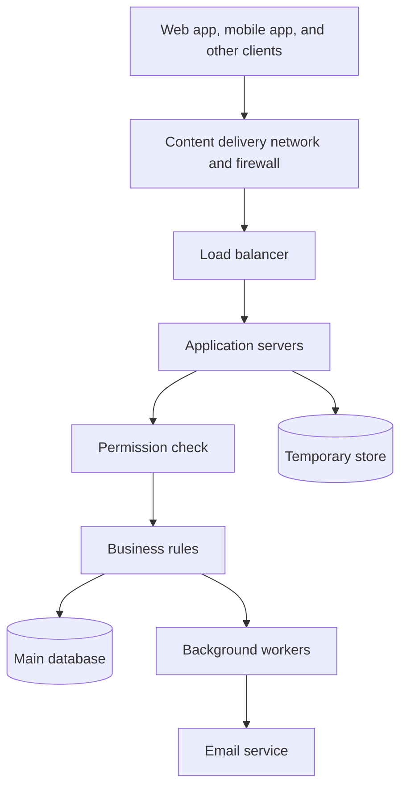
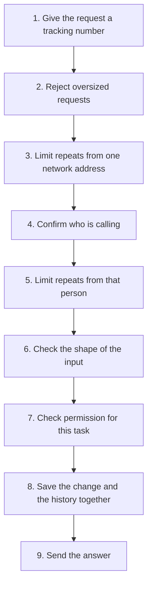

# High-Level Design — Task Management Platform

> **Audience:** engineers and reviewers who need to understand the shape of the system in ~15 minutes.
> **Companion documents:** [System Design](SYSTEM_DESIGN.md) (flows), [Data Architecture](DATA_ARCHITECTURE.md) (schema), [Security](SECURITY.md), [Scalability](SCALABILITY.md), [Availability](AVAILABILITY.md), [Observability](OBSERVABILITY.md).

---

## 1. Problem Statement

Build the backend for a Task Management Platform that supports:

- User registration and authentication
- Two principal types: **regular users** and **administrators**
- Task creation, retrieval, update and deletion
- Users may only act on **their own** tasks
- Administrators may act on tasks **across all users**
- All application programming interfaces (APIs) are secured

The deliverable is the architecture. The design below is what I would actually build and operate, not a maximal architecture.

---

## 2. Context, Constraints and Sizing Assumptions

Architecture is meaningless without a target. Every decision in this repository is justified against the numbers below. **This table is the canonical sizing baseline referenced by all other documents.**

| Dimension | Year-1 baseline | Design headroom | Notes |
|---|---|---|---|
| Registered users | 50,000 | 500,000 | Small relative to modern hardware |
| Daily active users | 5,000 | 50,000 | ~10% of monthly users are active on a given day for productivity tools |
| Peak request rate | 150 req/s | 1,500 req/s | Bursty: weekday mornings, standup times |
| Tasks stored | ~2 million | ~50 million | Well inside a single PostgreSQL instance |
| Tasks per user, 99th percentile | ~2,000 | ~20,000 | Drives the pagination decision |
| Read : write ratio | ~8 : 1 | — | Read-heavy, but not read-*dominated* |
| Payload size | < 8 KB | — | No file/attachment handling in v1 |

**Service level objectives (SLOs)** — these are the contract the architecture is designed to meet:

| service level objective (SLO) | Target |
|---|---|
| Monthly availability, based on server errors | 99.9% (~43 min error budget/month) |
| Latency, authenticated reads | 95th percentile (p95) < 200 ms, p99 < 500 ms |
| Latency, writes | p95 < 400 ms, p99 < 800 ms |
| Recovery point objective (RPO) | ≤ 5 minutes |
| Recovery time objective (RTO) | ≤ 30 minutes |

**Constraints**

- Single-region deployment in v1. Multi-region is an explicit non-goal (see section 13).
- Small team (2–4 backend engineers). Operational surface area is a first-class cost.
- No hard regulatory regime assumed beyond General Data Protection Regulation (GDPR)-style data subject rights.

**Non-functional priorities, in order:** correctness of authorization → data integrity → availability → latency → cost → feature velocity. Where two goals conflict, the earlier one wins. This ordering is why, for example, the design accepts a slightly slower write path in exchange for a durable audit trail.

---

## 3. Architecture Style: Modular Monolith

**Decision: a single deployable Python service, internally partitioned into modules with enforced boundaries, running as multiple stateless replicas.**

### Why not microservices

The domain has one aggregate root (`Task`) and one supporting aggregate (`User`). Splitting "auth service", "task service" and "admin service" would mean:

- A network hop and a distributed transaction on the single most important invariant in the system — *"this actor may touch this task"*.
- Three deployment pipelines, three on-call surfaces, three sets of dashboards for a team of 2–4.
- Eventual consistency between a user's `status = suspended` and the task service's view of it — a **security** regression, not just a consistency one.

Microservices solve organisational scaling and independent-failure-domain problems. At this size we have neither problem. Adopting them would be paying the distributed-systems tax with no return.

### Why not a plain layered monolith

An unpartitioned monolith decays.

The mitigation is cheap and mechanical: enforce module boundaries in CI (see [Development Practices](DEVELOPMENT_PRACTICES.md#7-enforcing-architecture-in-ci)) so `modules.tasks` may not import `modules.identity.repository`, only `modules.identity`'s published interface.

The boundaries are real from day one even though the deployment artefact is single.

### The extraction path

The modular monolith is designed so that the *first* service to be extracted is obvious and cheap. Ranked by likelihood:

1. **Background workers** — already a separate process from day one, sharing the codebase. Zero refactor needed.
2. **Notification/outbox dispatcher** — communicates only via the outbox table.
3. **Identity** — the only module with a genuinely different scaling and compliance profile.

`Tasks` would be extracted last, because it *is* the application.

---

## 4. Logical Architecture

The same picture, split into three so the boxes do not sit on top of each other, is in [diagrams/01-high-level-architecture.md](diagrams/01-high-level-architecture.md).

---

## 5. Component Responsibilities

| Component | Responsibility | Explicitly *not* responsible for |
|---|---|---|
| **content delivery network (CDN) + web application firewall (WAF)** | Transport Layer Security (TLS) termination, coarse L3/L4/L7 distributed denial of service (DDoS) absorption, Open Worldwide Application Security Project (OWASP) CRS rule set, bot/IP reputation, static asset delivery | Business authorization, per-user rate limits |
| **Load balancer** | Health-check-driven traffic distribution across availability zones (AZs), connection draining, request timeouts | Any application logic |
| **Middleware pipeline** | Correlation ID generation/propagation, JSON Web Token (JWT) verification → `Principal`, per-identity rate limiting, structured access logging, exception → Request for Comments (RFC) 9457 mapping | Deciding *whether* a principal may touch a *specific* object |
| **API layer** | Hypertext Transfer Protocol (HTTP) concerns only: routing, deserialisation, schema validation, status codes, content negotiation, versioning | Business rules, persistence |
| **Authorization policy engine** | The single place that answers `can(principal, action, resource)`. Both role checks and object-level ownership checks | Authentication (who you are) |
| **Application services** | Use-case orchestration, transaction boundaries, idempotency, audit emission, outbox writes | HTTP, Structured Query Language (SQL) dialect |
| **Domain layer** | Entities, value objects, invariants, the task status state machine. Pure Python, no I/O | Anything requiring a database or network |
| **Repository layer** | Query construction, mapping, unit of work, optimistic locking | Business decisions |
| **Job queue + workers** | Anything that must not block an HTTP response: email delivery, audit archival, soft-delete purging, token cleanup | Anything a user waits on synchronously |
| **PostgreSQL** | System of record. All invariants enforced with real constraints, not just application code | Queue semantics at high volume, full-text search at scale |
| **Redis** | Rate-limit counters, refresh-token/JWT denylist, job queue, small hot lookups | Being a source of truth. Total loss must be survivable |
| **Object storage** | Database backups, archived audit partitions | Serving user content in v1 |

### The authorization policy engine deserves its own component

In a system whose entire security model is *"users see their tasks, admins see everything"*, **broken object-level authorization is the dominant risk**. It is OWASP API Security Top 10 #1, and it is almost always caused by the check being scattered across handlers where one of them forgets.

So authorization is a named architectural component, not a decorator convention:

- Every read path narrows at the **query** level (`WHERE owner_id = :principal_id`), so a forgotten check returns *nothing* rather than *someone else's data*. Fail-closed by construction.
- Every write path calls `policy.authorize(principal, action, resource)` inside the service, *after* loading the resource and *inside* the transaction.
- A negative-path test matrix (every role × every endpoint × own/other/nonexistent resource) is a merge gate. See [Testing Strategy](TESTING_STRATEGY.md#6-the-authorization-test-matrix).

---

## 6. Request Lifecycle

The order of the middleware pipeline is itself a design decision — cheap and security-critical work happens before expensive work, so that a hostile request is rejected as early as possible.

Two details that matter:

- **Rate limiting is split** into a coarse pre-auth Internet Protocol address (IP) limit (cheap, protects the JWT verification path itself from being a DoS amplifier) and a fine post-auth per-identity limit (accurate, fair). Doing only the latter means an attacker with no token can still force signature verification work.
- **Audit record, domain mutation, and outbox event are written in the same transaction.** This is the core integrity guarantee: it is impossible for a task to change without a corresponding audit row, and impossible for a notification to be queued for a change that rolled back.

---

## 7. Authentication and Authorization Placement

| Concern | Where enforced | Why there |
|---|---|---|
| Is the token valid? | Middleware | Stateless, uniform, no per-route code |
| Is the token revoked? | Middleware, Redis denylist lookup | Needs shared state; see [Security section 4](SECURITY.md#4-token-revocation) |
| Is this role allowed this *action*? | Policy engine, called from service | Keeps HTTP layer free of business rules |
| May this principal touch this *object*? | Policy engine + repository query scoping | Defence in depth: query narrowing **and** explicit check |
| Is this state transition legal? | Domain layer | It is an invariant, not a permission |

The deliberate redundancy between query scoping and the explicit policy call is the point. A single-layer check has a single point of failure, and the failure mode is silent data disclosure.

---

## 8. Data Layer

PostgreSQL is the system of record for everything: users, credentials, tasks, audit log, idempotency keys, and the outbox. Full reasoning, schema, indexes, and transaction boundaries are in [Data Architecture](DATA_ARCHITECTURE.md).

Summary of the load-bearing choices:

- **Relational, not document.** The dominant query is "tasks owned by X, filtered by status, ordered by date" and the dominant invariant is a foreign-key relationship with an ownership check. This is exactly what a relational engine is for. A document store would push referential integrity into application code — the *one* place I am least willing to put it, since it is the security boundary.
- **Keyset (cursor) pagination, not offset.** `OFFSET 10000` forces the database to read and discard 10,000 rows, and it silently skips or repeats items when the underlying set changes between pages. Keyset pagination is O(log n) regardless of depth and is stable under concurrent writes.
- **Soft delete for tasks, with a scheduled hard purge.** Accidental deletion is the most common user-visible data-loss event, and administrators need to answer "what happened to this task?". A 30-day retention window balances recoverability against the GDPR right to erasure, which is served by a separate, genuinely destructive account-deletion path.
- **Optimistic concurrency** via a `version` column surfaced as an HTTP `ETag`. Two clients editing the same task is the realistic conflict in this domain; pessimistic locking would hold database locks across user think-time.

---

## 9. Asynchronous Processing

Work is asynchronous only when it satisfies one of: (a) it calls a third party, (b) it is slow, or (c) it is not required for the user's answer to be correct.

| Job | Trigger | Why async |
|---|---|---|
| Send verification / password-reset email | Outbox event | Third-party latency and failure must not affect the API's availability or response time |
| Archive audit partitions to object storage | Cron, monthly | Bulk I/O |
| Purge soft-deleted tasks past retention | Cron, daily | Bulk delete, must not hold locks during peak |
| Expire refresh tokens and idempotency keys | Cron, hourly | Housekeeping |

**The transactional outbox pattern is used deliberately.** Enqueuing a Redis job inside a database transaction is a distributed write across two systems with no shared commit: if the transaction rolls back after the enqueue, an email goes out about a change that never happened. Instead, the service inserts a row into `outbox_events` in the *same* transaction as the business change, and a dispatcher polls and publishes it. This gives at-least-once delivery with no dual-write inconsistency; consumers are made idempotent to absorb the "at-least".

Redis (not SQS/RabbitMQ) is the v1 broker because it is already in the stack for rate limiting. Introducing a second piece of infrastructure for four low-volume job types would be complexity without payoff. The queue is behind a `JobQueue` interface, so swapping to SQS is a single adapter.

---

## 10. External Integrations

| Integration | Purpose | Failure containment |
|---|---|---|
| Transactional email provider | Verification, password reset, admin notifications | Async only, behind an adapter interface, retried with exponential backoff and jitter, circuit breaker, dead-letter queue. A provider outage degrades onboarding, never core task operations |
| Secrets manager | DB credentials, JWT signing keys, provider API keys | Fetched at boot and cached in memory with time to live (TTL), so a control-plane blip does not crash healthy pods |
| OpenID Connect (OIDC) / single sign-on (SSO) provider | Enterprise sign-in | Deliberately deferred; the token design keeps the path open — see [Security section 12](SECURITY.md#12-what-i-deliberately-did-not-build) |

Every external dependency sits behind a port defined in our own domain terms (an anti-corruption layer). This is not ceremony: it is what makes the provider swappable and, more importantly, what makes it trivially fakeable in tests so the test suite never touches the network.

---

## 11. Infrastructure View

Reference deployment is Amazon Web Services (AWS); see [diagrams/04-deployment-view.md](diagrams/04-deployment-view.md) for the full topology and the GCP/Azure equivalents.

| Concern | Choice | Reasoning |
|---|---|---|
| Compute | Elastic Container Service (ECS) Fargate, ≥ 2 tasks across ≥ 2 AZs | Containers give environment parity; Fargate removes node management for a small team. **Kubernetes is not justified at this scale** — it is a platform to operate, and we would be paying for control-plane complexity we cannot yet amortise |
| Ingress | CloudFront + AWS WAF → Application Load Balancer (ALB) | Absorbs volumetric attacks before they reach compute |
| Database | Relational Database Service (RDS) PostgreSQL 16, Multi-availability zone (AZ) | Synchronous standby gives automatic failover; managed backups and point-in-time recovery (PITR) meet the 5-minute RPO |
| Cache/queue | ElastiCache Redis, Multi-AZ with automatic failover | Managed, same reasoning |
| Secrets | AWS Secrets Manager with rotation | Never in environment variables baked into images |
| Artifacts | ECR with image scanning and immutable tags | Supply-chain hygiene |

**On portability:** the design is deliberately built on commodity primitives — containers, a load balancer, managed PostgreSQL, managed Redis, object storage, OpenTelemetry. Every one has a direct equivalent on Google Cloud Platform (GCP) and Azure. I have avoided proprietary services (Lambda-centric design, DynamoDB, Cognito) whose data or programming models would be genuinely hard to unwind. The lock-in that remains is operational, not architectural.

---

## 12. Observability

Full detail in [Observability](OBSERVABILITY.md). The architectural commitment is that **a correlation ID is generated at the edge and is present on every log line, every span, every audit row, and every error response body**, so that a user reporting a problem can hand over one ID that resolves the entire request across the API, the worker, and the database.

Three pillars, one vocabulary:

- **Logs** — structured JavaScript Object Notation (JSON), no personally identifiable information (PII) in message bodies, `correlation_id` + `user_id` + `route` on every record.
- **Metrics** — rate, errors, and duration (RED) (rate, errors, duration) per route, utilization, saturation, and errors (USE) for infrastructure, plus business and security counters such as `auth_failures_total` and `authz_denials_total`. Authorization denials are a *security signal*: a sudden spike means someone is enumerating object IDs.
- **Traces** — OpenTelemetry auto-instrumentation for HTTP, SQLAlchemy, Redis, and the worker, with trace context propagated through the outbox so an email send links back to the API request that caused it.

---

## 13. Environments and Promotion

| Environment | Purpose | Data | Notes |
|---|---|---|---|
| Local | Development | Docker Compose, seeded fixtures | Identical major versions to production |
| CI | Automated verification | Ephemeral Postgres/Redis via Testcontainers | No shared state between runs |
| Staging | Pre-production verification | Anonymised subset | Same IaC modules as production, smaller instances |
| Production | Live | Real | Multi-AZ, change via pipeline only |

Promotion is by **immutable image digest**, not by rebuilding per environment. The artefact tested in staging is bit-identical to the one released. Configuration differs; code does not.

---

## 14. Deliberate Non-Goals

Stating what a design excludes is as informative as stating what it includes. These are omissions with reasons, not oversights.

| Not built | Why not | When I would revisit |
|---|---|---|
| Microservices | No organisational or scaling driver. See section 3 | Team > ~15 engineers, or genuinely divergent scaling profiles |
| Kubernetes | Operational cost exceeds benefit for a 2–4 person team | Multiple heterogeneous services, or a platform team exists |
| Multi-region active-active | Cross-region write consistency is a large problem; 99.9% does not need it | A hard 99.99% target, or data-residency requirements |
| command and query separation (CQRS) / event sourcing | The domain has no complex read-model or temporal-query requirement; the audit log already answers "what happened" | Complex analytics or regulatory replay requirements |
| GraphQL | Two client types with predictable needs; Representational State Transfer (REST)'s cacheability and simpler authorization story win | Many clients with highly divergent shapes |
| Caching task lists | Write-heavy per-user data with poor cache-hit characteristics and a real risk of serving another user's cached page. See [Scalability section 5](SCALABILITY.md#5-caching) | Measured read amplification on genuinely shared data |
| Full-text search engine | PostgreSQL `tsvector` + trigram indexes comfortably cover 50M rows | Relevance ranking or faceted search becomes a product requirement |

The unifying principle: **introduce infrastructure when a measured signal demands it, and know in advance what that signal is.** [Scalability section 2](SCALABILITY.md#2-the-evolution-path) states the numeric trigger for each of these.
