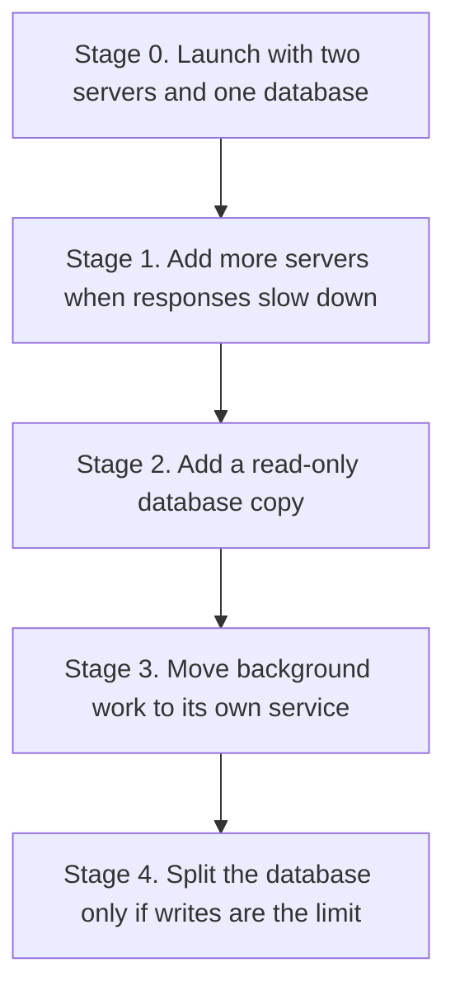

# Scalability

## 1. Principle: Earn Your Complexity

The assessment explicitly warns against adding infrastructure for its own sake, and I agree with the instinct strongly enough to make it the organising rule of this document.

Every piece of infrastructure has a permanent cost: it can fail, it must be monitored, patched and paid for, it becomes a new failure mode during incidents, and it must be understood by every engineer who joins. Adding a component to solve a problem you do not yet have means paying that cost continuously in exchange for nothing.

So each scaling step below has **a numeric trigger stated in advance**. This matters more than the list of technologies. Deciding the threshold before the pressure arrives is what stops scaling decisions from being made reactively at 2 a.m., and it is what makes "we don't need that yet" a defensible engineering position rather than a guess.

**Measure before you scale.** Most perceived scaling problems at this size are a missing index or an N+1 query. Sharding a database to fix an unindexed query is an expensive way to avoid reading a query plan.

---

## 2. The Evolution Path

| Stage | Trigger to enter | What is added | What it costs |
|---|---|---|---|
| **0 — Launch** | Day one | 2 replicas across 2 availability zones (AZs), Multi-availability zone (AZ) PostgreSQL, single Redis | Baseline |
| **1 — Growth** | 95th percentile (p95) > 200 ms sustained, or central processing unit (CPU) > 60% for 15 min | Horizontal autoscaling to 10, PgBouncer, caching for genuinely hot reads | Cache invalidation complexity; one more hop |
| **2 — Scale** | Read queries > 60% of primary CPU | Read replica with explicit routing, workers on separate compute, monthly audit partitioning | Replication lag becomes a correctness concern |
| **3 — Large** | Team > 15 engineers, or a module with a genuinely different scaling profile | Extract workers and identity, move to SQS/managed queue, offload search | Distributed systems tax: tracing, versioning, partial failure |
| **4 — Very large** | Single primary saturated on writes | Shard by `owner_id`, or Citus; possibly multi-region | Cross-shard queries, rebalancing, large operational burden |

**Stage 0 handles the year-one baseline from [High-Level Design (HLD) section 2](HLD.md#2-context-constraints-and-sizing-assumptions) with substantial headroom.** Two FastAPI replicas on modest instances comfortably serve 150 req/s of simple indexed queries, and PostgreSQL will not notice 2 million rows. Being honest that the launch architecture is *boring* is the point. I expect to reach Stage 2 and stop; Stages 3 and 4 are documented to show the path exists, not because I expect to walk it.

---

## 3. Horizontal Scaling and Load Balancing

The application is **stateless by construction**, which is the precondition for everything else here. No session state in process memory, no local file writes, no in-process scheduler, no sticky routing. Any replica can serve any request, so scaling is arithmetic rather than architecture.

Three things that would break statelessness, and where they go instead:

| Tempting local state | Where it actually lives |
|---|---|
| Session data | Client-held JSON Web Token (JWT) |
| Rate-limit counters | Redis, so limits are global rather than per-replica |
| Scheduled jobs | A single leader-elected worker, not every replica running its own cron |

That last one is a common and painful bug: an in-process scheduler in a 6-replica deployment sends every notification six times.

**Autoscaling** is driven primarily by p95 latency and request concurrency rather than CPU alone, because an I/O-bound async service can be saturated on connection capacity while CPU still looks idle — CPU-only autoscaling simply will not fire. Scale out is fast (add 2 replicas when p95 > 200 ms for 2 minutes), scale in is slow (remove 1 replica after 10 minutes below target), because aggressive scale-in causes thrashing and the cost saving is trivial compared to a latency incident.

Minimum 2 replicas always, in separate availability zones, so a single instance or AZ failure is never a total outage.

**Load balancing** uses least-outstanding-requests rather than round robin. Round robin assumes uniform request cost; here an admin list query costs far more than a health check, so round robin sends work to replicas that are already busy. Health checks hit `/health/ready` every 10 seconds with a 2-failure threshold, and connection draining is 30 seconds to match graceful shutdown.

### The real constraint is database connections, not CPU

This is the ceiling people miss. Each replica holds a connection pool; `replicas × pool_size` must stay below PostgreSQL's `max_connections`. With a pool of 20 and `max_connections = 200`, the hard limit is 10 replicas — and PostgreSQL's per-connection memory overhead means simply raising `max_connections` degrades performance rather than solving it.

**PgBouncer in transaction mode** is therefore the first Stage 1 addition: hundreds of client connections multiplex onto a few dozen server connections, decoupling replica count from database connection limits. The constraint it introduces is that session-level features — `SET` statements, session advisory locks, some prepared-statement behaviour — must not be used, which is a code constraint worth accepting early rather than discovering later.

---

## 4. Database Scaling

Applied in strict order of cost-effectiveness. Steps 1 and 2 solve almost every real problem at this scale.

**Step 1 — Query optimisation.** Free, and the highest-yield step by a wide margin. `pg_stat_statements` ranks queries by total time; `auto_explain` captures plans for anything over 500 ms. The usual findings are a missing composite index, an N+1 from a lazy relationship, offset pagination on a deep page, or `SELECT *` pulling a 10 KB description into a list view. Each is fixed in one commit with no new infrastructure.

**Step 2 — Vertical scaling.** Unglamorous and extremely effective. Doubling instance size is a maintenance-window restart and buys roughly 2× headroom. Modern managed instances reach 128 vCPU and 4 TB of RAM; 50 million task rows fit in memory long before that ceiling. Engineers reach for sharding when they should reach for a bigger instance, and pay for it for years.

**Step 3 — Read replicas.** Added when read queries exceed ~60% of primary CPU. Routing is explicit per query type, as specified in [Data Architecture section 7](DATA_ARCHITECTURE.md#7-data-consistency): a user's own data and all authorization lookups stay on the primary, because stale permission data is a security bug rather than a staleness bug. Replication lag is monitored, and the router falls back to the primary when lag exceeds 1 second.

**Step 4 — Partitioning.** `audit_log` is partitioned monthly from Stage 2 — it is the fastest-growing, never-updated table, and dropping an archived partition is instant where deleting millions of rows is not. `tasks` is *not* partitioned: partitioning helps when queries prune to a partition, and task queries filter by `owner_id`, which does not align with a time-based scheme. Partitioning by `owner_id` hash would be sharding-in-one-box and is Stage 4 territory.

**Step 5 — Sharding.** The last resort, by `owner_id` since it is present in essentially every query. It breaks cross-user admin queries and global reporting, and rebalancing is genuinely hard. I would exhaust Citus and managed distributed PostgreSQL first. At the stated sizing this is theoretical, and I include it to show the path, not to suggest walking it.

---

## 5. Caching

**Nothing that users write is cached at launch, and that is a design decision rather than an omission.**

The tempting first move is caching `GET /tasks`. I would not, for three reasons. The data is per-user, so there is no reuse across users and the hit rate is bounded by how often one person reloads their own list. The data is write-heavy relative to reads, so entries are invalidated almost as fast as they are populated.

And a cache key bug on per-user data means serving one user's tasks to another — the exact failure this system's security model exists to prevent, now reachable without any authorization flaw at all.

A cache that improves p95 by 20 ms while adding an invalidation surface and a cross-user leakage risk is a bad trade when the underlying query is already an indexed lookup returning in under 10 ms.

### What is cached, and why each is safe

| Cached | time to live (TTL) | Why it is a good candidate |
|---|---|---|
| JSON Web Key Set (JWKS) public keys | 5 min | Shared, tiny, read on every request, changes quarterly |
| Rate-limit counters | Window length | Redis is the correct home for this, not a cache of a database |
| Token denylist | Token lifetime | Must be shared across replicas; small and self-expiring |
| Breached-password corpus | Process lifetime | Static, read on registration, in-process bloom filter |
| Application config | 5 min | Shared, rarely changes |

The pattern: cache what is **shared, expensive to compute, and slow to change**. Per-user task lists are none of those.

### When I would revisit

If `pg_stat_statements` shows a specific query consuming disproportionate database CPU with a genuinely high repeat rate, I would cache *that query*, with a user-scoped key, a short TTL, explicit invalidation on write, and a measured before/after hit rate. Targeted, measured, reversible — the opposite of "add Redis caching to the read path".

**Hypertext Transfer Protocol (HTTP) caching is used from day one**, and is nearly free: `ETag` on single resources plus `If-None-Match` yields `304 Not Modified` for unchanged tasks, saving bandwidth for polling mobile clients without any server-side cache state. Authenticated responses carry `Cache-Control: no-store` so intermediaries never retain user data.

---

## 6. Background Processing

The queue exists so that slow and third-party work never sits on the request path. It does not exist to make everything asynchronous — moving work off the request path costs observability, adds eventual consistency, and introduces a new failure mode, so it needs a reason.

| Job | Trigger | Why it belongs off the request path |
|---|---|---|
| Verification and reset emails | Outbox | Third-party latency and failure must not affect application programming interface (API) availability |
| Soft-delete purge | Daily cron | Bulk delete; must not hold locks during peak |
| Token and idempotency-key cleanup | Hourly cron | Housekeeping |
| Audit archival | Monthly cron | Bulk I/O to object storage |
| Data export | User request | Can take minutes; returns a job ID and notifies on completion |

Scheduled jobs run on **a single leader-elected worker** using a PostgreSQL advisory lock, not on every replica. Every job is **idempotent**, because the queue guarantees at-least-once delivery and a duplicated "send password reset email" is a support ticket while a duplicated purge is data loss.

**Redis + arq is the v1 broker** because Redis is already present for rate limiting and the volume is low. A managed queue (SQS) becomes worthwhile at Stage 3, when durability guarantees and dead-letter handling justify it; the `JobQueue` port makes that a single adapter swap. Workers share the codebase but run as a separate process from day one, so they can scale independently and so extracting them later requires no refactor at all.

---

## 7. Rate Limiting

Rate limiting is presented here as a *scalability* control, not only a security one: it is what keeps one client from consuming capacity that belongs to everyone else, and it is the difference between a degraded client and a degraded platform.

**Token bucket** rather than a fixed window. A fixed window permits a double-rate burst across a window boundary — 60 requests at 11:59:59 and 60 more at 12:00:00 is 120 in one second against a "60/min" limit. Token bucket allows a controlled burst while enforcing the average, which matches how real clients behave: idle, then a burst on page load.

Counters live in Redis so limits are global rather than per-replica. A per-replica limiter silently multiplies the effective limit by the replica count, and worse, the effective limit then *changes when you autoscale*.

Limits and tiers are specified in [API Design section 6](API_DESIGN.md#6-rate-limiting).

Two details that matter operationally: the split between a coarse pre-authentication Internet Protocol address (IP) limit and a fine post-authentication per-identity limit, so unauthenticated traffic cannot force expensive signature verification; and `RateLimit-*` headers on every response, so well-behaved clients can pace themselves instead of discovering limits by being rejected.

**If Redis is unavailable, rate limiting fails open** — requests proceed unlimited, with an alert. Failing closed would convert a cache outage into a total outage. The exposure is bounded because the web application firewall (WAF) still enforces coarse limits at the edge, which is exactly why the edge limit exists as a separate layer.

---

## 8. Traffic Spikes

Autoscaling is not a spike response. It takes 60–120 seconds to place a container, warm a connection pool and pass health checks, and a real spike arrives in seconds. Anything that depends on reacting has already failed.

The defence is layered, ordered from fastest to slowest:

| Layer | Response time | Mechanism |
|---|---|---|
| content delivery network (CDN) and WAF | Immediate | Absorbs volumetric and bot traffic before it reaches compute |
| Rate limiting | Immediate | Caps per-client consumption |
| Provisioned headroom | Immediate | Run at ~50% utilisation so a 2× spike needs no reaction at all |
| Load shedding | Sub-second | Above a concurrency threshold, reject low-priority traffic with `503` + `Retry-After` |
| Queue depth limits | Immediate | Reject rather than accumulate unbounded backlog |
| Autoscaling | 60–120 s | Handles sustained elevation, not the initial edge |
| Scheduled pre-scaling | Ahead of time | For known events such as a marketing launch |

**Load shedding is the control people skip, and it is what separates a degraded system from a dead one.** When a system accepts more work than it can complete, queues grow, latency climbs past client timeouts, clients retry, and load increases — a congestion collapse where the system does no useful work at all while consuming every resource. Shedding at the door keeps throughput at capacity instead of driving it to zero, and it is the reason a retry budget exists ([System Design section 9](SYSTEM_DESIGN.md#9-cross-cutting-behaviour)): retries must never exceed ~10% of traffic, or the client fleet becomes the attacker.

Priority under shedding: health checks and authentication are never shed; writes are preferred over reads, since a failed write loses user work while a failed read is retried harmlessly; bulk and admin analytics are shed first.

---

## 9. Scaling With Data Volume

Growth in *rows* behaves differently from growth in *traffic*, and needs distinct thinking.

| Growth dimension | Effect | Mitigation |
|---|---|---|
| Tasks per user reaching 20,000 | List queries slow with offset pagination | Keyset pagination is O(log n) at any depth — already in place |
| Total tasks reaching 50 million | Index size, vacuum pressure | Partial indexes exclude deleted rows; autovacuum tuned for the write rate |
| Audit log growing without bound | The fastest-growing table by far | Monthly partitioning plus archival; drop partitions rather than delete rows |
| Very large single accounts | One user degrades shared resources | Per-user quotas; statement timeouts; bounded page sizes |
| Description fields | Large rows evict hot pages from cache | `SELECT` explicit columns; list endpoints never return `description` |

That last point is a small detail with a large effect. A list endpoint returning 50 tasks each with a 10 KB description transfers 500 KB and pushes useful pages out of the buffer cache. List views return a summary projection; the full body is fetched only on the detail endpoint.

---

## 10. What Would Actually Break First

Predicting the first bottleneck is a more useful exercise than describing the end state, because it determines what to monitor now.

| Rank | Bottleneck | Symptom | Fix | Stage |
|---|---|---|---|---|
| 1 | **Database connection exhaustion** | `TooManyConnections`, latency cliff, healthy CPU | PgBouncer | 1 |
| 2 | **An unindexed query as data grows** | One endpoint degrades while others are fine | Read the plan, add the index | 0–1 |
| 3 | **Autovacuum falling behind** | Table and index bloat, gradual slowdown | Tune per-table autovacuum thresholds | 1–2 |
| 4 | Redis as a single point of contention | Rate-limit latency, hot-key contention | Redis cluster or client-side sharding | 2 |
| 5 | Worker backlog on an email-provider outage | Queue depth climbs, notifications delayed | Circuit breaker, dead-letter queue, scale workers | 1–2 |
| 6 | Audit log write amplification | Write latency rises on every mutation | Partitioning; batch low-severity writes | 2 |
| 7 | Primary write saturation | Sustained high write latency | Sharding | 4 |

**Connection exhaustion is ranked first because it is the one that surprises teams.** Every dashboard looks healthy — CPU low, memory fine, queries fast — while requests queue waiting for a connection that never frees. It is also the bottleneck that arrives *because* you scaled out, so the instinctive response of adding replicas makes it strictly worse. Connection-pool saturation is therefore a first-class monitored metric with an alert from day one, not something discovered during an incident.
