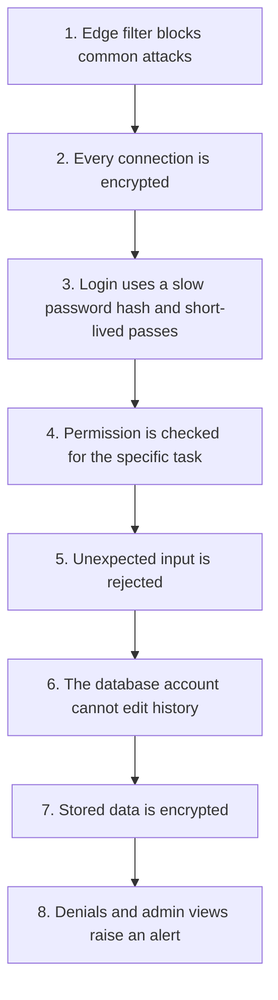

# Security Architecture

Short forms are written out the first time they appear. The full list is in the [glossary](GLOSSARY.md).

## 1. Threat Model First

Controls without a threat model are cargo cult. This system's realistic adversaries and their objectives:

| Adversary | Objective | Primary control |
|---|---|---|
| Opportunistic attacker with a credential-stuffing list | Take over accounts | Argon2id, breach-corpus checks, dual-axis login rate limiting, anomaly alerting |
| Authenticated user probing for gaps | Read or modify another user's tasks | Object-level authorization, query-level scoping, `404` responses, denial alerting |
| Attacker who obtains a token | Persist access | Short access-token lifetime, refresh rotation with reuse detection, denylist |
| Malicious or compromised administrator | Mass data access | Read auditing, least privilege, self-modification prohibited, anomaly detection |
| Automated scanner / botnet | Resource exhaustion, known CVEs | web application firewall (WAF), tiered rate limits, dependency scanning, request size caps |
| Insider with infrastructure access | Direct database access | Encryption at rest, identity and access management (IAM)-scoped credentials, no shared logins, audited access |
| Supply-chain attacker | Malicious dependency | Lockfiles with hashes, software composition analysis (SCA) in CI, software bill of materials (SBOM), image scanning, pinned base images |

**The single highest-probability, highest-impact risk is broken object-level authorization.** That is item 1 on the Open Worldwide Application Security Project (OWASP) list of application risks.

It is the risk most specific to this system's shape. No outer firewall catches it, and it fails silently. The architecture treats it as the main design concern, not one item on a checklist.

Controls are mapped explicitly against the OWASP API Security Top 10 in section 11.

---

## 2. Defence in Depth



The organising assumption is that **any single layer will eventually fail**. The design question is not "is this control sufficient" but "what happens after it is bypassed". A leaked access token is bounded by a 15-minute lifetime.

A missing authorization decorator is caught by query-level scoping. A Structured Query Language (SQL) injection attempt hits a parameterised statement executed under a database role that cannot read the credentials table.

---

## 3. Authentication

### Password storage

**Argon2id**, the Password Hashing Competition winner and the OWASP first recommendation. Parameters: 64 MiB memory, 3 iterations, parallelism 4 — tuned so a single verification costs roughly 200 ms on production hardware, then re-benchmarked annually.

Argon2id is used instead of bcrypt and PBKDF2 because it is hard on memory, not only on processor time. Special hardware can guess a processor-only hash cheaply. A memory-hard hash makes that hardware expensive.

Argon2**id** specifically — the hybrid mode — because Argon2i alone is weaker against time-memory trade-off attacks and Argon2d alone is vulnerable to side channels.

Operational details: a per-password random salt is embedded in the encoded hash; the work factor is versioned, and a successful login with an outdated factor transparently rehashes; the 128-character maximum bounds the CPU cost so that submitting a megabyte password is not a denial-of-service primitive.

### Token design

| Property | Access token | Refresh token |
|---|---|---|
| Type | JSON Web Token (JWT), Edwards-curve Digital Signature Algorithm (EdDSA) (Ed25519) | Opaque, 256 bits from a CSPRNG |
| Lifetime | 15 minutes | 30 days, sliding |
| Server state | None | SHA-256 hash in PostgreSQL |
| Claims | `sub`, `role`, `jti`, `iat`, `exp`, `iss`, `aud`, `tv` | n/a |
| Transport | `Authorization: Bearer` | `HttpOnly` cookie, or body for native clients |

**Why an opaque refresh token rather than a second JWT.** A refresh token must be revocable — that is its entire operational purpose over a 30-day window. A JWT is only revocable through a denylist, which reintroduces the state a JWT exists to avoid, but without the benefit: refresh happens rarely, so the database lookup is free. Using a JWT here would be complexity with a negative return.

**`tv` — token version.** The user row holds a `token_version` counter; the access token carries its value at issue time. Incrementing the counter on a password change, role change, or suspension invalidates every outstanding access token for that user in one write, with no denylist enumeration. This is the mechanism that makes "sign out everywhere" and "revoke a compromised session" cheap and immediate.

The tension this resolves is real: stateless tokens are fast but not revocable; the version counter buys revocability back at the cost of one cached lookup, without giving up statelessness on the hot path.

### Key management

Signing keys live in the secrets manager and never touch a repository, an image, or an environment variable in a task definition.

Rotation is quarterly and automatic, overlapping: the new key is published to the JSON Web Key Set (JWKS) endpoint and honoured for verification *before* it is used for signing, so no valid token is ever rejected during a rotation.

Each key has a `kid`, and the verifier resolves by `kid` against a cached JWKS with a 5-minute time to live (TTL).

The algorithm is pinned in the verifier. Accepting the `alg` header from the token is the classic JWT vulnerability — it permits `alg: none` and the HMAC-with-the-public-key confusion attack. The verifier accepts `EdDSA` and nothing else, and `iss` and `aud` are validated on every request so a token minted for another environment cannot be replayed into production.

---

## 4. Token Revocation

| Event | Mechanism | Latency |
|---|---|---|
| User logs out | Refresh token revoked; access `jti` added to a Redis denylist with TTL = remaining lifetime | Immediate |
| Log out everywhere | `token_version` incremented; all refresh tokens revoked | Immediate |
| Password changed | `token_version` incremented | Immediate |
| Role or status changed | `token_version` incremented | Immediate |
| Refresh reuse detected | Entire token family revoked, user notified | Immediate |
| Access token simply expires | Natural expiry | ≤ 15 min |

The denylist is small by construction — it holds only explicitly revoked, still-unexpired `jti` values, each self-expiring. **If Redis is unavailable the system fails open on the denylist specifically**, accepting tokens that are otherwise cryptographically valid and unexpired.

This is a deliberate, narrow exception to fail-closed: the alternative is that a cache outage logs out every user simultaneously, which is a self-inflicted total outage.

The exposure is bounded to 15 minutes for the small set of explicitly revoked tokens, the `token_version` check still runs against PostgreSQL, and the condition is alerted on. Every other authorization decision fails closed.

---

## 5. Authorization

### Two roles, one decision point

```python
# Illustrative — the shape of the policy API, not production code.

class Policy:
    def authorize(self, principal: Principal, action: str, resource: Resource | None = None) -> None:
        """Raise AuthorizationError unless the action is permitted. Never returns a bool."""
        if action not in ROLE_PERMISSIONS[principal.role]:
            audit.denied(principal, action, resource, reason="missing_permission")
            raise AuthorizationError(action)

        if resource is not None and not self._owns_or_admin(principal, resource):
            audit.denied(principal, action, resource, reason="not_owner")
            raise AuthorizationError(action)
```

Three properties of this API are deliberate:

1. **It raises rather than returning a boolean.** A boolean can be ignored — `policy.can(...)` on a line by itself compiles, passes review, and grants everyone everything. An exception cannot be accidentally discarded.
2. **It is the only place the rules live.** Adding a permission means editing one table; auditing the model means reading one file.
3. **It audits its own denials.** Detection is built into the control rather than bolted on, so every denial is a security signal by construction.

### Layered enforcement

| Layer | Mechanism | Failure mode if this layer alone is wrong |
|---|---|---|
| Router | Namespace-wide admin dependency on `/admin` | New admin endpoint is unprotected |
| Service | Explicit `policy.authorize(...)` after load | Cross-user mutation |
| Repository | `WHERE owner_id = :principal_id` | Cross-user read |
| Database | Foreign keys, `CHECK` constraints | Orphaned or invalid rows |

No single layer is trusted. The most valuable of these is repository scoping, because its failure mode is an *empty result* rather than *someone else's data* — the system degrades toward returning nothing, which is the correct direction for a security control to fail.

### Least privilege at the database

The application connects as a role with `SELECT`/`INSERT`/`UPDATE`/`DELETE` on business tables, `INSERT`/`SELECT` only on `audit_log` (append-only: the application **cannot** update or delete audit rows, so an application-level compromise cannot erase its own tracks), no database structure change (DDL), and no superuser.

Migrations run as a separate role in a separate pipeline step.

---

## 6. Input Validation

Validation is at the boundary, and it is strict by default.

| Control | Implementation |
|---|---|
| Schema validation | Pydantic v2 models on every request body, query string, and path parameter |
| Unknown fields | `model_config = ConfigDict(extra="forbid")` — rejected with `422`, never ignored |
| Type coercion | Strict mode: `"5"` is not accepted for an integer field |
| Size limits | 1 MB body at the edge and in the application; per-field length caps |
| Enums | Closed enums; arbitrary strings never reach the database |
| unique identifiers (UUIDs) | Parsed and validated before any query |
| Timestamps | Request for Comments (RFC) 3339 with an explicit offset; naive datetimes rejected |

**Rejecting unknown fields matters more than it sounds.** Silently ignoring `{"owner_id": "<someone-else>"}` hides the fact that a client is attempting mass assignment. Rejecting it turns a silent probe into a logged, alertable `422`.

### Injection classes

| Class | Control |
|---|---|
| SQL injection | SQLAlchemy parameterised queries only. Raw SQL requires a bound `text()` construct and review; string-interpolated SQL is blocked by a lint rule in CI |
| Sort/filter injection | Whitelisted column mapping; a client string never becomes a SQL identifier |
| NoSQL / command injection | No NoSQL store; no shell invocation with user input |
| Stored cross-site scripting (XSS) | Output is JavaScript Object Notation (JSON) with correct content types; `X-Content-Type-Options: nosniff`; escaping is the client's responsibility but the API never emits user content into an HTML context |
| SSRF | No user-supplied web address (URL) is fetched in v1. When webhooks arrive: allowlisted schemes, Domain Name System (DNS) re-resolution with private-range blocking, no redirect following, egress through a proxy |
| Header injection | Newlines stripped from any user value that reaches a header |
| Log injection | Structured logging: user values are JSON-encoded *fields*, never concatenated into a message string |

---

## 7. Secrets Management

| Secret | Storage | Rotation |
|---|---|---|
| Database credentials | Secrets manager, IAM-scoped | 30 days, automatic |
| JWT signing keys | Secrets manager | 90 days, overlapping |
| Email provider API key | Secrets manager | 90 days |
| Redis auth token | Secrets manager | 90 days |
| Encryption keys | Cloud Key Management Service (KMS), never exported | Annual, with re-wrapping |

Rules: no secret in source control, ever; no secret in an image layer or a task-definition environment variable; secrets fetched at boot over an authenticated channel and cached in memory with a TTL, so a secrets-manager blip does not crash healthy pods; secrets never logged — the logging pipeline runs a redaction filter over known key names as a backstop; separate secrets per environment, with no production access from developer machines.

`gitleaks` runs as a pre-commit hook and as a CI gate. A committed secret is treated as compromised and rotated, not deleted from history and forgotten — history is public the moment it is pushed.

---

## 8. Transport and Headers

Transport Layer Security (TLS) 1.3 minimum (1.2 permitted only with AEAD ciphers), HTTP Strict Transport Security (HSTS) with `max-age=31536000; includeSubDomains; preload`, certificates rotated automatically, and TLS re-encryption between the load balancer and the application so traffic is not plaintext inside the virtual private cloud (VPC).

| Header | Value | Purpose |
|---|---|---|
| `Strict-Transport-Security` | `max-age=31536000; includeSubDomains; preload` | Prevents downgrade |
| `X-Content-Type-Options` | `nosniff` | Prevents MIME confusion |
| `X-Frame-Options` | `DENY` | Clickjacking |
| `Content-Security-Policy` | `default-src 'none'; frame-ancestors 'none'` | Locks down the API origin, which serves no HTML |
| `Referrer-Policy` | `strict-origin-when-cross-origin` | Prevents URL leakage |
| `Cache-Control` | `no-store` on authenticated responses | Keeps user data out of intermediary caches |

**cross-origin resource sharing (CORS) is an explicit allowlist of origins** with `allow_credentials=True`. Wildcard origins are prohibited, and the combination of `*` with credentials is rejected by the browser anyway. Preflight results are cached for 10 minutes.

---

## 9. Abuse Protection

Beyond the rate limits in [API Design section 6](API_DESIGN.md#6-rate-limiting):

| Vector | Control |
|---|---|
| Automated registration | Per-Internet Protocol address (IP) limits, disposable-domain blocklist, mandatory email verification, CAPTCHA triggered only on anomalous rates rather than for every user |
| Credential stuffing | Per-IP *and* per-account counters, breach-corpus rejection at registration, alerting on distributed low-and-slow patterns |
| Enumeration | Uniform registration responses, constant-time login paths, time-sorted unique identifier (UUIDv7) identifiers, `404` for unauthorized objects |
| Resource exhaustion | Per-user task quota, bounded page sizes, statement timeouts, connection-pool limits, capped request bodies |
| Expensive-query abuse | Whitelisted sorts, mandatory indexed filters, a 5-second statement timeout as the backstop |
| Password-reset flooding | 3/hour per account, single-use tokens, 15-minute expiry |
| Mass data extraction by an admin | Result-count thresholds that force an audited async export path, plus volume-anomaly alerting |

---

## 10. Sensitive Data Protection

| Data | Classification | At rest | In transit | In logs | Retention |
|---|---|---|---|---|---|
| Password | Secret | Argon2id hash, never recoverable | TLS | **Never** | Lifetime of account |
| Refresh token | Secret | SHA-256 hash | TLS + `HttpOnly` cookie | **Never** | 30 days |
| Reset / verification token | Secret | SHA-256 hash | TLS | **Never** | 15 min / 24 h |
| Email address | personally identifiable information (PII) | AES-256 volume encryption | TLS | Masked: `a***@example.com` | Lifetime of account |
| Display name | PII | AES-256 | TLS | User ID only | Lifetime of account |
| Task title / description | User content | AES-256 | TLS | **Never** — ID only | Until deleted + 30 days |
| IP address | PII under General Data Protection Regulation (GDPR) | AES-256 | TLS | Truncated last octet | 90 days |
| Audit log | Security record | AES-256 | TLS | n/a | 1 year hot, 7 years archived |

**Task content never appears in logs.** Log a task ID, never a title. Titles routinely contain exactly what should not be in an observability pipeline — customer names, deal values, medical appointments. The logging layer enforces this with a field allowlist on domain objects rather than relying on developers to remember.

### GDPR posture

Right of access is served by a self-service data export; right to erasure by a genuine hard-delete job that removes tasks and credentials and pseudonymises the subject identifier in the audit log while preserving the integrity of the audit trail itself.

Data minimisation means the system collects email, display name and password and nothing else. Retention is enforced by scheduled jobs, not by policy documents — an unenforced retention policy is not a control.

---

## 11. OWASP API Security Top 10 Coverage

| Risk | Status | Primary controls |
|---|---|---|
| API1 Broken object level authorization | **Primary design concern** | Policy engine, query scoping, `404` responses, denial audit, full authorization test matrix |
| API2 Broken authentication | Addressed | Argon2id, EdDSA, rotation with reuse detection, dual-axis rate limiting, uniform errors |
| API3 Broken object property level authorization | Addressed | `extra="forbid"`, explicit response models, immutable fields, no `owner_id` on input |
| API4 Unrestricted resource consumption | Addressed | Rate limits, page caps, quotas, statement timeouts, body size caps |
| API5 Broken function level authorization | Addressed | Separate `/admin` namespace with a namespace-wide guard, privileged-by-default |
| API6 Unrestricted access to sensitive business flows | Partially addressed | Registration and reset throttling; anomaly detection is v1.1 |
| API7 Server side request forgery | Not applicable in v1 | No user-supplied URL is fetched; controls specified for webhooks |
| API8 Security misconfiguration | Addressed | IaC-only changes, hardened headers, no debug in production, least-privilege IAM, config validated at boot |
| API9 Improper inventory management | Addressed | Generated OpenAPI, versioned endpoints, per-version usage metrics, documented deprecation |
| API10 Unsafe consumption of third-party application programming interfaces (APIs) | Addressed | Provider responses validated, timeouts, circuit breakers, no implicit trust |

---

## 12. What I Deliberately Did Not Build

| Control | Why not now | Trigger to add it |
|---|---|---|
| multi-factor authentication (MFA) / time-based one-time password (TOTP) | Real value, but meaningful cost in enrolment, recovery flows and support. Password strength plus breach checking plus rotation covers the dominant threat first | Enterprise customers, or any privileged-account requirement. **I would make it mandatory for admins before general availability** |
| single sign-on (SSO) / OpenID Connect (OIDC) federation | No stated requirement; the token design keeps the seam clean | First enterprise customer |
| Field-level encryption of task content | Volume encryption plus least-privilege access is proportionate for a task tracker. Field-level encryption breaks search and adds key-management burden | Regulated or genuinely sensitive content |
| HSM-backed signing keys | KMS is sufficient at this scale | Compliance requirement |
| Full anomaly-detection platform | Requires a behavioural baseline that does not yet exist | Once there is 3+ months of production traffic to learn from |
| Penetration test | Cannot be done against a design | **Before general availability.** Scoped explicitly at authorization boundaries |

Listing these is the point. A security architecture that claims to have covered everything is either dishonest or has not been thought about; what matters is knowing which gaps are open, why, and what closes them.

---

## 13. Incident Response

| Phase | Action |
|---|---|
| Detect | Alerts on authorization-denial spikes, refresh-reuse events, privilege changes, login-failure anomalies, egress-volume anomalies |
| Contain | Suspend accounts and increment `token_version`; revoke token families; rotate keys; WAF rule at the edge; feature-flag the affected path off |
| Investigate | Correlation ID reconstructs the full request path; the append-only audit log reconstructs the sequence of state changes; the application cannot have altered it |
| Recover | point-in-time recovery (PITR) for data corruption; forced re-authentication; credential rotation |
| Learn | Blameless post-mortem, a regression test for the specific failure, control updated |

**Deliberate design for forensics.** The correlation ID and the append-only audit log exist so that the question "what exactly did this actor do?" has a definitive answer. Most incident response is slow not because containment is hard but because nobody can establish what happened. The audit log is written in the same transaction as every state change, and the application's database role has no `UPDATE` or `DELETE` on it.
