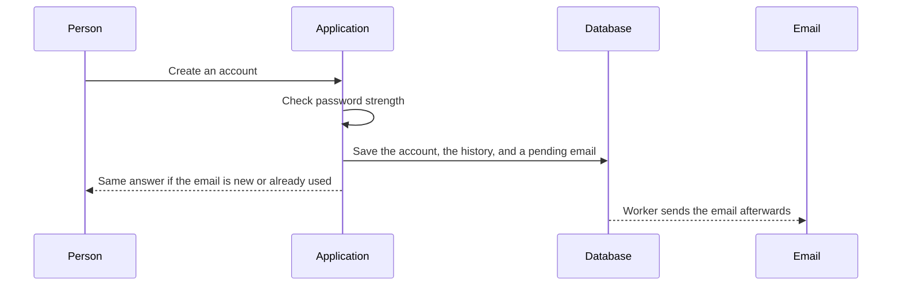
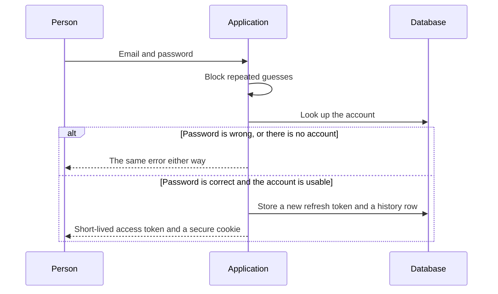
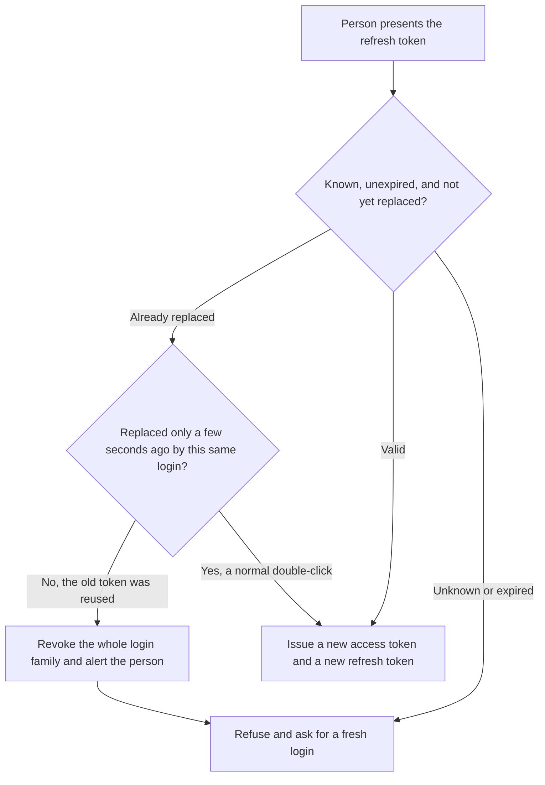
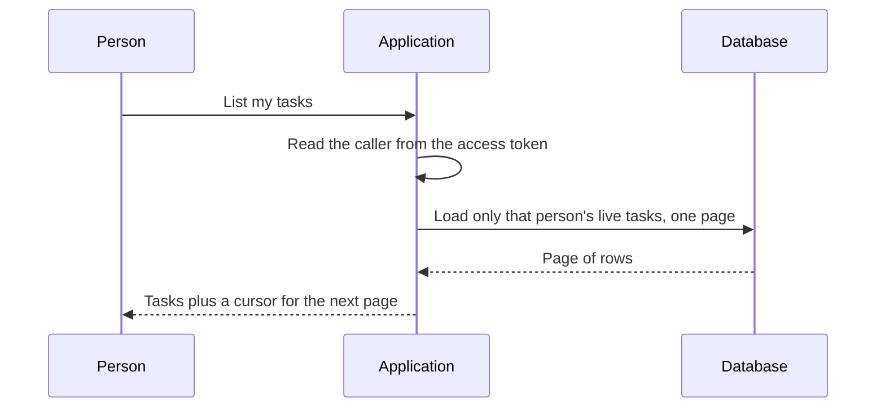
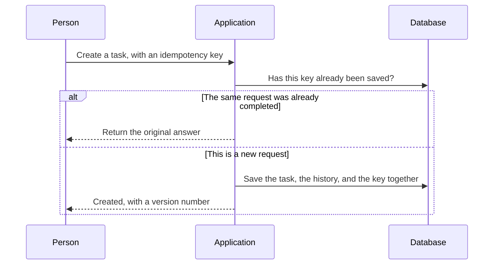
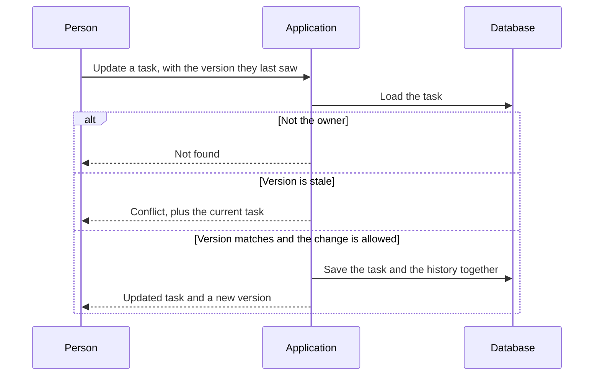
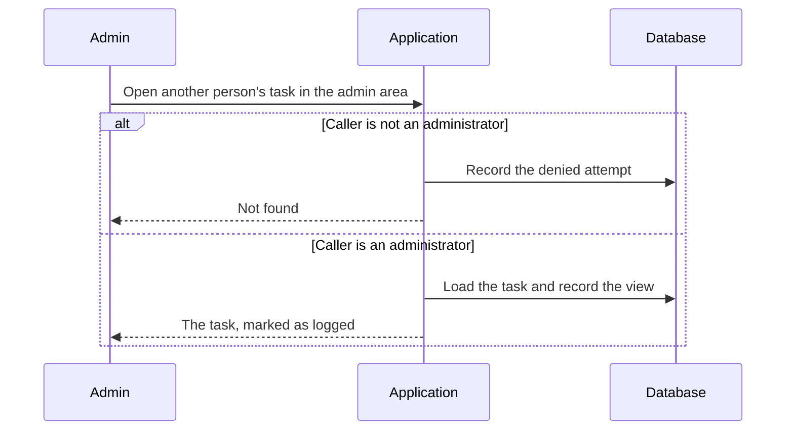

# System Design — Major Flows

Short forms are written out the first time they appear. The full list is in the [glossary](GLOSSARY.md).

This document walks through the flows that define the system's behaviour. For each one I cover the happy path, the interactions that matter, and the failure and edge cases that drove the design.

**Flows covered:** [Registration](#1-user-registration) · [Authentication](#2-authentication) · [Token refresh](#3-token-refresh-with-reuse-detection) · [Listing tasks](#4-user-accessing-their-tasks) · [Creating a task](#5-creating-a-task) · [Updating a task](#6-updating-a-task) · [Deleting a task](#7-deleting-a-task) · [Admin cross-user access](#8-administrator-accessing-another-users-task)

---

## 0. Conventions Used Throughout

| Concept | Rule |
|---|---|
| **Principal** | The authenticated identity: `{user_id, role, token_id, token_version}`, derived from the access token by middleware. Never taken from the request body or a query parameter. |
| **Correlation ID** | Minted at the edge if absent, echoed in the `X-Correlation-ID` response header, attached to every log line, span and audit row. |
| **Transaction boundary** | Exactly one database transaction per state-changing use case, opened and committed by the application service. Neither the application programming interface (API) layer nor the repository layer commits. |
| **Audit** | Every state change writes an `audit_log` row in the same transaction as the change itself. |
| **Errors** | Request for Comments (RFC) 9457 `application/problem+json`. See [API Design section 4](API_DESIGN.md#4-error-model). |
| **Resource not visible** | Returns `404`, never `403` — a `403` confirms the resource exists and turns the endpoint into an existence oracle. |

---

## 1. User Registration

### Design decisions

**The response is identical whether or not the email already exists.** A registration endpoint that returns `409 Conflict` for a taken address is a user-enumeration oracle: an attacker can harvest which addresses hold accounts and use that list for credential stuffing and phishing. Instead both branches return `202 Accepted` with the same body, and the *email* carries the difference — a verification link for a new account, or a "someone tried to register with your address; reset your password instead" notice for an existing one. The real owner of the mailbox learns the truth; the attacker learns nothing.

This costs usability: a user who forgot they had an account gets a slightly confusing flow. The email copy mitigates it. I consider that trade worthwhile for a system holding credentials.

**`202`, not `201`.** The account row exists, but the account is not yet usable — it is unverified. `202 Accepted` honestly describes "request accepted, processing continues out of band". Returning `201 Created` would imply a fully provisioned resource the client can now use.

**Password policy follows NIST SP 800-63B**: minimum 12 characters, maximum 128 (bounded to prevent a attack that wastes processor time on password hashing), checked against a breached-password corpus, with no composition rules or forced rotation. Composition rules ("one uppercase, one symbol") measurably push users toward predictable patterns like `Password1!`. Length and breach-checking are what actually correlate with resistance to guessing.

**Verification tokens are stored hashed** (SHA-256), exactly like passwords, and are single-use with a 24-hour expiry. A database read must not yield a usable credential.

**Timing.** Argon2id is intentionally slow, so the "already exists" branch — which skips hashing — would return measurably faster and leak the same information the response body was designed to hide. The service therefore performs a dummy hash on the conflict path so both branches cost the same.

---

## 2. Authentication

### Design decisions

**Two token types with different properties, because they have different jobs.**

| | Access token | Refresh token |
|---|---|---|
| Format | JSON Web Token (JWT), Edwards-curve Digital Signature Algorithm (EdDSA) (Ed25519) signed | Opaque 256-bit random string |
| Lifetime | 15 minutes | 30 days, sliding |
| Storage (server) | Not stored | SHA-256 hash in PostgreSQL |
| Storage (client) | In memory | `HttpOnly` cookie |
| Verified by | Signature check, no I/O | Database lookup |
| Revocable | Only via denylist | Immediately |

The access token is stateless so that the hot path — every authenticated request — needs no database round trip.

The cost is that it cannot be instantly revoked, which is bounded to 15 minutes and further reduced by a denylist for explicit logout and security events.

The refresh token is stateful precisely because revocation matters over a 30-day horizon; making it a JWT would give up that control for no benefit, since it is presented rarely and a database lookup at that frequency is free.

**EdDSA over HMAC.** Asymmetric signing means a future extracted service, or a gateway, can verify tokens with a public key without holding the ability to *mint* them. That is a meaningful blast-radius reduction. Ed25519 specifically, rather than RSA, for smaller signatures and no padding-mode footguns.

**Access token in memory, refresh token in an `HttpOnly` cookie.** This is the combination that resists both major browser attacks: cross-site scripting (XSS) cannot read an `HttpOnly` cookie, and the access token's short life plus memory-only storage limits what a successful XSS can steal. The cookie's `SameSite=Strict` and narrow `Path` blunt cross-site request forgery (CSRF), and because the refresh endpoint is the only cookie-authenticated route, that is the only place CSRF applies. Non-browser clients receive the refresh token in the response body instead.

**Login failures are counted on two axes.** Per-account counters stop a classic brute-force against one victim; per-IP/ASN counters stop credential stuffing that tries one password against thousands of accounts — an attack that per-account limits are structurally blind to. Backoff is exponential rather than a hard lock, because a hard account lock hands an attacker a cheap denial-of-service against any user whose email they know.

**Errors are generic.** `401` says "invalid email or password" without distinguishing which. The specific `403` reason codes are only emitted once the password has already been verified, so they disclose nothing to an attacker who does not already hold valid credentials.

---

## 3. Token Refresh with Reuse Detection

This flow is short but is the most security-sensitive in the system, so it is documented separately.

**Why rotation with reuse detection.** A refresh token is a 30-day bearer credential; if it leaks, the attacker has a month of access. Rotation means each token is valid exactly once. That alone does not help if the attacker uses the stolen copy first — but it creates a detectable event, because the *legitimate* client will then present the now-revoked token. Either way round, one of the two parties triggers reuse detection, and the response is to revoke the whole family. The legitimate user is forced to re-authenticate, which is a small cost; the attacker is evicted, which is the point.

**Tokens are grouped into a `family_id`** so that a single detection revokes the entire lineage descending from one login, not just the individual token.

**Race condition, handled honestly.** A client that fires two refreshes concurrently (a mobile app resuming with several queued requests) can legitimately trigger reuse detection. Mitigations: clients serialise refresh through a single-flight mutex, and the server allows a 10-second grace window during which the *immediately preceding* token in a family is accepted and returns the same successor rather than triggering revocation. That window is short enough to be useless to an attacker and long enough to absorb realistic client races. I prefer naming this trade-off to pretending rotation is free.

---

## 4. User Accessing Their Tasks

### Design decisions

**Ownership is a query predicate, not a post-filter.** `owner_id` comes from the verified `Principal`. There is no code path where a client-supplied `owner_id` reaches this query — the field is not in the request schema at all, so Pydantic rejects it. The security property this buys: if someone later adds a filter and forgets an authorization check, the worst outcome is an empty result set, not a leak. The system fails closed.

**Keyset pagination over offset.** Offset pagination degrades linearly with depth (`OFFSET 10000` reads and discards 10,000 rows) and is *incorrect* under concurrent writes — inserting a task while a user pages shifts every subsequent page, causing duplicates and skips. The keyset predicate `(created_at, id) < (cursor)` maps directly onto the composite index and is O(log n) at any depth. The cursor is opaque and base64-encoded so clients cannot build one by hand and we can change its internals.

The trade-off is no random page access — you cannot jump to "page 47". For a task list that is a non-requirement; infinite scroll and "next/previous" are the real interaction patterns. `id` is included as a tiebreaker because `created_at` is not unique, and without it rows at an identical timestamp can be skipped at a page boundary.

**`LIMIT :limit + 1`** determines `has_more` without a second `COUNT(*)` query, which on a large filtered set is the most expensive part of a paginated read.

**No total count by default.** An exact count requires scanning the whole matching set. It is available behind an explicit opt-in flag, and beyond a threshold returns an estimate from the query planner's statistics.

**Deliberately not cached.** See [Scalability section 5](SCALABILITY.md#5-caching) — per-user, write-heavy data with low reuse. A cache here would add invalidation complexity and a genuine risk of cross-user leakage in exchange for little hit rate.

---

## 5. Creating a Task

### Design decisions

**Idempotency keys on create.** `POST` is not idempotent, and the realistic failure is not exotic: a client times out at 5 seconds, the server committed at 5.2 seconds, the client retries, and the user has two identical tasks. With an `Idempotency-Key` header the server stores the outcome against the key and replays it on retry. The key insert is the *first* statement in the transaction, so the unique constraint — not application logic — arbitrates concurrent duplicates.

A fingerprint of the request body is stored with the key, so reusing a key with a *different* body returns `422` rather than silently replaying an unrelated response. Keys expire after 24 hours.

**`owner_id` is never accepted from the client.** It is set from the `Principal` inside the domain factory. This is the single most important line in the create path: accepting `owner_id` from a request body is how systems end up letting users create records attributed to other people.

**Validation happens in two distinct places, for two distinct reasons.** Pydantic handles *shape* — types, lengths, enum membership, format — and rejects with a clear `422` before any business code runs. The domain layer handles *rules* — a task cannot start in `done`, `due_at` must respect the state machine. Shape validation at the boundary keeps malformed input out; rule validation in the domain means the rules hold no matter which entry point calls them, including background jobs and future admin tooling.

**The `ETag` returned is the task's `version`**, which the client will send back as `If-Match` on update.

---

## 6. Updating a Task

### Design decisions

**Authorization happens after the load and inside the transaction.** You cannot decide whether a principal may modify an object until you know who owns it. Keeping the check inside the transaction means the ownership fact the decision was based on cannot change underneath it.

**Optimistic concurrency, two layers.** The `If-Match`/`ETag` exchange gives the *client* a way to say "I am editing version 3" and receive a clean `412` with the current state if that is stale — enough information to merge or prompt the user. Independently, the `UPDATE ... WHERE version = :expected` guard catches the narrow window between the in-transaction `SELECT` and the `UPDATE`. Under `READ COMMITTED` that window is real, and a zero-row result is how we detect it.

I chose optimistic over pessimistic (`SELECT FOR UPDATE`) because conflicts here are rare and user think-time is long. Pessimistic locking would hold a row lock across a human editing session, converting a rare conflict into a common stall, and inviting deadlocks.

**`PATCH`, not `PUT`.** Clients update one or two fields at a time. `PUT` requires sending the full representation, which turns every partial edit into a read-modify-write and makes accidental field clobbering the default behaviour. Distinguishing "field absent" from "field explicitly set to null" is handled with a sentinel in the schema.

**The status state machine lives in the domain**, not in a validator. `todo → in_progress → done`, with `done → in_progress` permitted (reopening) and `done → todo` rejected. Encoding this as an entity method rather than scattered `if` statements means every caller — Hypertext Transfer Protocol (HTTP), admin path, future bulk import — obeys the same rules.

**The audit row records a before/after diff of changed fields only.** Storing whole snapshots on every edit bloats the table; storing only the delta answers the question anyone actually asks ("who changed the due date, and what was it before?").

---

## 7. Deleting a Task

Delete is a soft delete: `UPDATE tasks SET deleted_at = now(), deleted_by = :principal_id, version = version + 1`.

- Every read path already filters `deleted_at IS NULL`, and a **partial index** on that predicate keeps the filter free.
- A daily worker hard-deletes rows past the 30-day retention window.
- Owners and administrators can restore within the window via `POST /api/v1/tasks/{id}/restore`.
- The unique constraint on `(owner_id, title)` — if enabled — must be partial on `deleted_at IS NULL`, otherwise a deleted task blocks re-creating one with the same title.
- Returns `204 No Content`. Deleting an already-deleted task returns `204` as well: `DELETE` is idempotent, and the caller's desired end state has been achieved.

**General Data Protection Regulation (GDPR) erasure is a separate, genuinely destructive path.** Soft delete is for user convenience and does not satisfy a right-to-erasure request. Account deletion runs a distinct job that hard-deletes tasks and credentials and pseudonymises the principal's identifier in the append-only audit log — the audit log itself must remain intact, since it is a security and integrity control. Conflating the two is a common and expensive compliance mistake.

---

## 8. Administrator Accessing Another User's Task

### Design decisions

**A separate `/admin` namespace rather than role-widening the user endpoints.** The tempting alternative is one `GET /tasks` handler that returns everything when `principal.role == "admin"`. I rejected it because it puts the privilege boundary *inside* a function that also serves unprivileged traffic — and the failure mode of a bug there is full cross-tenant data disclosure. A separate router gives:

- Static reviewability: every privileged operation is in one directory, and "show me everything an admin can do" is `ls`, not a code audit.
- A namespace-wide dependency that asserts the admin role, so a new endpoint is privileged-by-default rather than public-by-accident.
- Independent rate limits, independent audit treatment, and the option to restrict the namespace by network origin or require step-up authentication later.

The cost is some duplication between user and admin handlers. I accept it: shared *service* logic keeps the duplication to thin routing and serialisation, and a little repetition is cheap insurance against a catastrophic authorization bug.

**Admin reads are audited, not just admin writes.** In a task system the sensitive administrative action is usually *looking*, not changing. An audit log that only records mutations cannot answer "did anyone read this user's tasks?" — which is exactly the question asked after an insider-access incident. Admin list operations therefore record the target user, the filters and the result count.

**`404`, not `403`, for non-admins hitting the admin namespace.** A `403` confirms the endpoint exists and is worth attacking. `404` makes the namespace invisible to unprivileged callers. The denial is still logged at high severity internally — the caller learns nothing, we learn everything.

**Admins cannot escalate silently.** Role changes are themselves audited operations, an admin cannot change their own role, and the last remaining admin account cannot be demoted or deleted — a constraint enforced in the database, not only in application code, so a bug or a manual query cannot lock the organisation out.

**Not built in v1:** justification prompts ("why are you accessing this account?") and time-boxed break-glass elevation. Both are the right answer at larger scale. The audit schema already carries a nullable `justification` field so adding them is additive.

---

## 9. Cross-Cutting Behaviour

| Concern | Behaviour |
|---|---|
| **Timeouts** | Layered and decreasing inward: client 10 s → load balancer 30 s → application 8 s → database statement 5 s → external HTTP call 3 s. Each layer must be *tighter* than the one outside it, or an inner hang consumes the outer layer's connection pool. |
| **Retries** | Only on idempotent operations and only for transient classes: connection errors, deadlocks, `503`. Exponential backoff with full jitter, capped at 3 attempts, with a budget so retries can never exceed ~10% of traffic and turn a partial outage into a self-inflicted stampede. |
| **Connection pooling** | Per-replica SQLAlchemy pool sized so that `replicas × pool_size` stays under 60% of `max_connections`; PgBouncer in transaction mode once replica count makes that arithmetic tight. |
| **Graceful shutdown** | On `SIGTERM`: fail readiness immediately, keep liveness healthy, drain in-flight requests up to 25 s, close pools, exit. The load balancer stops sending new traffic before the process stops accepting it. |
| **Clock skew** | JWT validation allows 60 s leeway on `exp`/`nbf`. All stored timestamps are `TIMESTAMPTZ` in UTC; the server never trusts a client clock for anything security-relevant. |
| **Request size** | Capped at the edge (1 MB) and in the application. An unbounded body is a trivial memory-exhaustion vector. |
