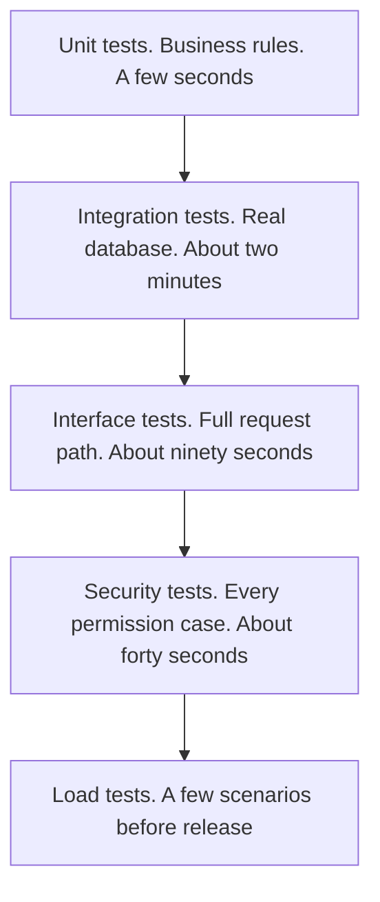

# Testing Strategy

Short forms are written out the first time they appear. The full list is in the [glossary](GLOSSARY.md).

## 1. What the Test Suite Is For

A test suite has one job: **make it safe to change the system**. That reframing drives every choice below. Tests that assert implementation details make change harder and are a net negative. Tests that pin down behaviour a user depends on make change safe.

It follows that testing effort should be weighted by the **cost of the defect**, not spread evenly:

| Failure | Cost | Testing weight |
|---|---|---|
| A user reads another user's tasks | Breach, disclosure, loss of trust | **Exhaustive** |
| Privilege escalation | Total compromise | **Exhaustive** |
| Data loss or corruption on a write | Unrecoverable user harm | Very high |
| Token handling flaw | Account takeover | Very high |
| Wrong sort order on a list | Mild annoyance | Low |
| Imperfect error message wording | Negligible | None |

This is why the authorization matrix (section 6) is a first-class part of the strategy rather than a subsection of application programming interface (API) tests.

---

## 2. Shape of the Suite



A conventional pyramid, with one deliberate distortion: **security tests are pulled out as their own tier and run on every commit** rather than being folded into API tests or deferred to a periodic scan. They target the system's primary risk, they are fast, and treating them as a separate gate means nobody can merge past them.

**Real dependencies, not mocks, for anything involving the database.** Integration and API tests run against a real PostgreSQL via Testcontainers. Mocking a database means testing your assumptions about Structured Query Language (SQL) rather than SQL — and the defects that actually occur are constraint violations, transaction semantics, locking behaviour and query plans, none of which a mock can express. Containers make this cheap enough that there is no excuse.

What *is* faked: the email provider, the clock, and the breach-corpus lookup — external, slow, or nondeterministic things, each already behind a port for exactly this reason.

---

## 3. Unit Tests

**Target:** the domain layer and the policy engine. No I/O, no fixtures, microseconds per test.

These are the correctness-critical pure functions of the system, which is precisely why the architecture keeps them free of infrastructure ([Code Structure section 3](CODE_STRUCTURE.md#3-layer-responsibilities)).

| Area | What is tested |
|---|---|
| Task state machine | Every transition, legal and illegal, including self-transitions |
| Task invariants | Title bounds, `completed_at` coherence with status, tag limits, version increment |
| Policy engine | Every role × action × ownership combination |
| Password policy | Length bounds, breach rejection, email-substring rejection |
| Token claims | Construction, expiry arithmetic, version embedding |
| Cursor codec | Round-trip, tamper rejection, malformed input |
| Pagination | Boundary conditions, `has_more` calculation |

```python
# Illustrative — exhaustive transition coverage, not hand-picked cases.

@pytest.mark.parametrize(
    ("start", "target", "allowed"),
    [
        (TODO, IN_PROGRESS, True),
        (TODO, DONE, True),
        (IN_PROGRESS, DONE, True),
        (DONE, IN_PROGRESS, True),    # reopening is permitted
        (DONE, TODO, False),          # but not resetting
        (TODO, TODO, True),           # idempotent no-op
    ],
)
def test_status_transitions(start, target, allowed):
    task = TaskFactory.build(status=start)
    if allowed:
        task.change_status(target)
        assert task.status is target
    else:
        with pytest.raises(InvalidStateTransition):
            task.change_status(target)
```

**Property-based testing** (Hypothesis) is used where the input space is large and edge cases are hard to enumerate by hand: cursor encode/decode round-trips for arbitrary inputs, the invariant that `version` strictly increases across any sequence of updates, and the invariant that an owner never changes.

---

## 4. Integration Tests

**Target:** services and repositories against a real PostgreSQL. Each test runs in a transaction that is rolled back, so tests are isolated and fast without recreating the schema.

| Area | What is tested |
|---|---|
| Transaction boundaries | A failure mid-use-case leaves no partial state |
| Audit atomicity | **No state change ever exists without its audit row** |
| Optimistic locking | Concurrent updates: one wins, the other gets a conflict |
| Constraints | Unique email, foreign keys, `CHECK` violations surface as domain errors |
| Soft delete | Deleted rows are invisible to every read path |
| Keyset pagination | Stability under concurrent inserts; no skips or duplicates |
| Idempotency | Replay returns the stored response; a different body is rejected |
| Outbox | Events are written in the same transaction and rolled back with it |
| Migrations | Up and down against a populated database |

Two tests in this tier are worth calling out because they verify architectural claims made elsewhere in this documentation:

```python
async def test_concurrent_update_one_writer_loses(session_factory, task):
    """The version guard must detect a lost update — a real race, not a simulated one."""
    async with session_factory() as s1, session_factory() as s2:
        svc1, svc2 = TaskService(s1), TaskService(s2)
        await svc1.update(owner, task.id, {"title": "A"}, if_match=1)
        with pytest.raises(ConcurrentModification):
            await svc2.update(owner, task.id, {"title": "B"}, if_match=1)

async def test_failed_update_writes_no_audit_row(uow, task, monkeypatch):
    """Audit and mutation share one transaction, so a rollback must discard both."""
    monkeypatch.setattr(TaskRepository, "save", raising_stub)
    with pytest.raises(Exception):
        await TaskService(uow).update(owner, task.id, {"title": "X"}, if_match=1)
    assert await count_audit_rows(task.id) == 0
```

The second test guards a claim that appears throughout this repository — that the audit log cannot diverge from reality. An assertion is worth more than the assertion in prose.

**Migration testing** deserves emphasis because it is commonly skipped and its failure mode is a production outage. Each migration is applied to a database seeded with representative data, verified, and rolled back. This catches the constraint that cannot be added because existing rows violate it, and the backfill that times out at scale.

---

## 5. API Tests

**Target:** the full stack through Hypertext Transfer Protocol (HTTP), with a real database and fake external adapters. These test the contract a client actually depends on.

Per endpoint: the happy path with a correct status code and response shape; validation failures with per-field error details; unauthenticated and unauthorized access; not-found; conflict and precondition paths; rate limiting; and pagination.

Cross-cutting: correlation IDs echoed on every response including errors, Request for Comments (RFC) 9457 conformance, security headers, cross-origin resource sharing (CORS) preflight behaviour, `ETag`/`If-None-Match` yielding `304`, and `Idempotency-Key` replay.

**Contract tests** validate every response against the generated OpenAPI schema, and a schema-diff check fails the build on a breaking change without a version bump. This is what makes "the API cannot drift from its documentation" a verified property rather than an intention.

---

## 6. The Authorization Test Matrix

**This is the single most important part of the strategy**, because broken object-level authorization is the system's dominant risk ([Security section 1](SECURITY.md#1-threat-model-first)) and it is the class of defect least likely to be caught by any other means. It produces no error, no log entry, and no user complaint — it silently returns data.

Every task endpoint is tested against every combination of actor and resource, **generated** rather than hand-written, so a new endpoint cannot be added without appearing in the matrix.

| Actor | Own resource | Another user's resource | Nonexistent | Soft-deleted |
|---|---|---|---|---|
| Anonymous | `401` | `401` | `401` | `401` |
| User, unverified email | `403` | `403` | `403` | `403` |
| User, suspended | `401` | `401` | `401` | `401` |
| User, active | Succeeds | **`404`** | `404` | `404` |
| Admin, via `/api/v1/tasks` | Succeeds | **`404`** | `404` | `404` |
| Admin, via `/api/v1/admin/tasks` | Succeeds | **Succeeds** | `404` | Succeeds |

```python
@pytest.mark.parametrize("actor", ALL_ACTOR_TYPES)
@pytest.mark.parametrize("target", ["own", "other", "missing", "deleted"])
@pytest.mark.parametrize("endpoint", TASK_ENDPOINTS)   # collected from the router
async def test_authorization_matrix(client, actor, target, endpoint):
    response = await call(client, endpoint, actor, target)
    assert response.status_code == EXPECTED[actor][target][endpoint.method]
```

Three properties of this matrix are deliberate:

**The `404`-not-`403` rule is asserted, not assumed.** Row 4, column 2 is the whole system's security model in one cell. If someone "helpfully" changes that to `403` for better developer experience, the build fails and the conversation happens in review rather than after a penetration test.

**Admins get `404` on the user endpoint.** An administrator using `/api/v1/tasks` sees only their own tasks. Privilege applies in the admin namespace and nowhere else, which is what makes the namespace separation meaningful rather than decorative.

**Endpoints are collected from the router**, so adding a task endpoint without extending the expectation table is a test failure. The matrix cannot silently fall behind the API.

Beyond the matrix, targeted tests cover mass assignment (`owner_id` and `role` in a request body are rejected, not ignored), `IDOR` via every identifier-bearing parameter, and privilege escalation via self-role-change.

---

## 7. Security Testing

| Category | Approach |
|---|---|
| Authorization | The matrix above, plus insecure direct object reference (IDOR) and mass-assignment probes |
| Authentication | Tampered signatures, `alg: none`, expired tokens, wrong `iss`/`aud`, tokens from another environment, replayed refresh tokens |
| Token lifecycle | Reuse detection revokes the family; `token_version` bump invalidates all access tokens |
| Injection | SQL payloads in every string field, sort and filter parameters, and cursors |
| Rate limiting | Limits enforced, headers correct, counters reset, per-account and per-Internet Protocol address (IP) axes independent |
| Enumeration | Registration responses identical for new and existing addresses; login timing variance within tolerance |
| Data exposure | Assert `password_hash`, `token_version` and internal IDs never appear in any response; assert no secret appears in captured logs |
| Headers | Security headers present; CORS rejects disallowed origins |
| Dependencies | `pip-audit` and Trivy in CI |
| Static analysis | `bandit` and `semgrep` with custom rules |

A custom `semgrep` rule set targets this codebase's specific hazards: a service method that loads a resource without a subsequent `policy.authorize` call, any f-string reaching a SQL execution call, a response model missing on a route, and a logger call receiving a domain object rather than explicit fields.

**Timing-attack testing is statistical, not exact.** The login path is sampled across many requests for valid and invalid users and the distributions are compared, failing if the difference exceeds a tolerance. This verifies the dummy-hash mitigation from [System Design section 2](SYSTEM_DESIGN.md#2-authentication) actually works — a control that is easy to write and easy to silently break, since removing it changes nothing visible.

**Penetration testing is scheduled before general availability and annually thereafter,** scoped explicitly at authorization boundaries and multi-tenant isolation. Automated tests verify the controls we thought of; a penetration test finds the ones we did not. Neither replaces the other.

---

## 8. Performance and Load Testing

Run against staging with production-shaped data volumes — 50,000 users, 2 million tasks, realistic distribution including a few outlier accounts with 20,000 tasks each.

Testing against a small seeded database is worse than not testing, because it produces confident numbers that are wrong. Query plans change with data volume: a sequential scan that is fine over 1,000 rows is catastrophic over 2 million, and it will not appear until production.

| Scenario | Purpose | Pass criteria |
|---|---|---|
| Baseline | Normal load, 150 req/s for 30 min | 95th percentile (p95) within service level objective (SLO), zero errors |
| Stress | Ramp to failure | Identify the actual breaking point and confirm it is where section 10 of Scalability predicts |
| Spike | 10× for 60 s | Degrades gracefully, sheds load, recovers without intervention |
| Soak | 50% load for 8 h | No memory growth, no connection leak, no index bloat |
| Pagination depth | Page to 10,000 items | Latency stays flat, proving keyset pagination behaves as designed |
| Large account | One user with 20,000 tasks | No degradation for other users |
| Failover | Force a database failover under load | Read-only mode engages; recovery within the stated window |

The soak test earns its place: connection leaks and unbounded memory growth are invisible in a 10-minute run and cause an outage three days after release.

Beyond throughput, load tests verify claims made elsewhere in this documentation. The stress test should reveal connection-pool exhaustion as the first bottleneck, and the failover test should demonstrate read-only degradation.

**If the measured bottleneck is not the predicted one, the mental model is wrong** — and that is a more valuable result than a green pass, because it means the monitoring and scaling plan were aimed at the wrong thing.

---

## 9. Test Data and Determinism

Factories (`factory_boy`) rather than shared fixtures, so each test declares exactly the state it needs and there is no hidden coupling through a global seed set. Fixture files that many tests depend on become impossible to change.

Determinism rules: the clock is injected and frozen, randomness is seeded, unique identifiers (UUIDs) are generated through an injectable source, no test depends on execution order, and each runs in a rolled-back transaction. `pytest-randomly` shuffles the order on every run so order dependencies surface immediately rather than on the day someone adds a test in the middle.

**No test touches the network.** External adapters are fakes that record calls and can be told to fail, which is what makes it practical to test retry, timeout and circuit-breaker behaviour — paths that are otherwise almost never exercised until they are needed in production.

---

## 10. Coverage, and Its Limits

| Scope | Target | Rationale |
|---|---|---|
| `security/` | **100% branch** | An untested branch here is a breach, not a bug |
| `modules/*/domain/` | 100% | Pure and trivial to cover |
| `modules/*/service.py` | 90% | Error paths included |
| Overall | 85% | Sufficient without gaming |

Coverage measures which lines executed, not whether behaviour is correct. A suite can reach 95% while asserting almost nothing. It is used here as a **floor that detects untested code**, not as a quality metric — and the one place a hard 100% is demanded is the one place where the cost of a missed branch justifies it.

The more meaningful signal is **mutation testing** (`mutmut`) run periodically against `security/` and `domain/`. It introduces small faults — flipping a comparison, removing a check — and verifies that a test fails.

If mutating `if principal.role != "admin"` to `==` leaves the suite green, the authorization tests are decorative. That is the question coverage cannot answer, and it is the right question to ask of the code that matters most.