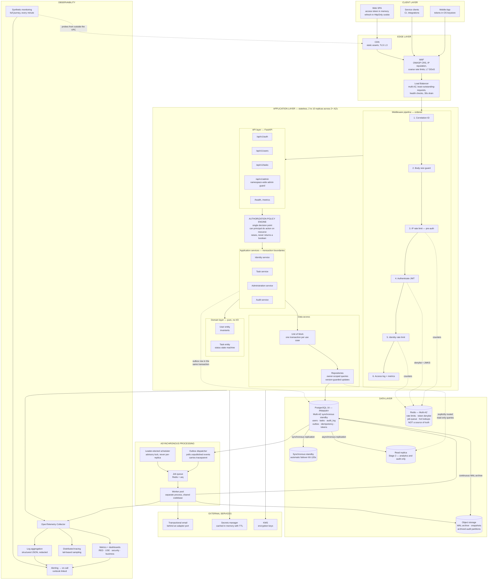

# Diagram 1 — High-Level Architecture

The system decomposed into layers, showing every component and the direction of data and control flow. Discussed in [HLD §4–§5](../HLD.md#4-logical-architecture).

## Reading the diagram

**The vertical axis is trust.** Everything above the application layer is untrusted input. The middleware pipeline is the boundary, and its ordering is deliberate — cheap, security-critical checks run before expensive ones, so a hostile request is rejected before it can consume signature-verification CPU.

**The policy engine sits between routing and services**, and every path through the application crosses it. It is drawn as a distinct box rather than folded into the services because object-level authorization is the system's primary risk and the design treats it as a component with an owner, not a convention.

**Redis is reachable only from the middleware and the queue.** It never appears on a path that produces an authoritative answer, which is what makes total Redis loss survivable.

**The outbox arrow points from PostgreSQL to the dispatcher, not from the services to the queue.** That is the transactional outbox pattern in one detail: services write events to the database inside the business transaction, and the dispatcher publishes them afterwards. There is no path by which a service writes directly to the queue, so a rolled-back transaction can never emit an event.

**Read replica arrows are dashed and labelled "explicitly routed."** Replica reads are a per-query decision, never a default, because a user's own data and all authorization lookups must come from the primary.

---

**Related:** [HLD §4 Logical Architecture](../HLD.md#4-logical-architecture) · [HLD §5 Component Responsibilities](../HLD.md#5-component-responsibilities) · [HLD §6 Request Lifecycle](../HLD.md#6-request-lifecycle)
