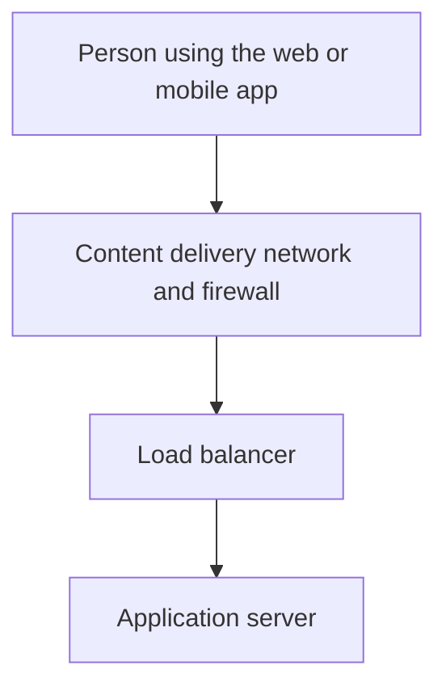
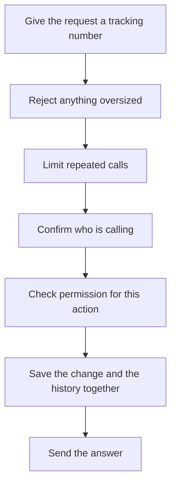
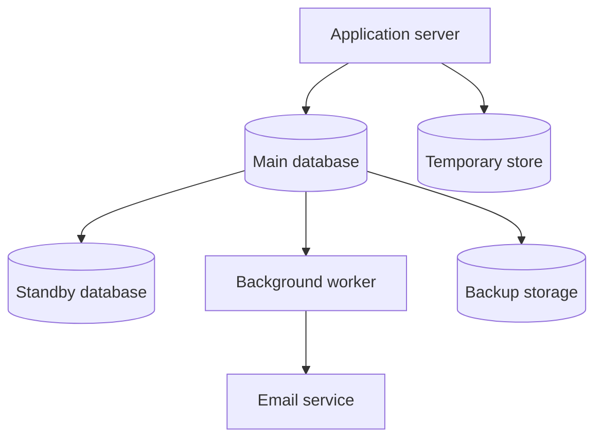

# Diagram 1 — High-Level Architecture

The system is shown as three small pictures instead of one crowded drawing. Each picture is one idea.

The written design is in [High-Level Design, sections 4 to 6](../HLD.md#4-logical-architecture).

---

## 1. How a request travels

A person uses the web or mobile app. The request is checked at the edge, then handed to an application server.

The edge blocks obvious attacks. The load balancer sends the request to a healthy server. Any server can answer, because the servers do not keep private memory of the user.

---

## 2. What the application does with it

Every request walks the same path. Cheap checks happen first, so a bad request is rejected before it does expensive work.

Permission is its own step. A user can only reach their own tasks. An administrator uses a separate admin area, and that access is recorded.

---

## 3. Where information is kept

The main database is the source of truth. The standby is a live copy used if the main database fails.

The temporary store holds rate limits, revoked login passes, and the job queue. It is not the source of truth. If it is lost, the service slows down. It does not lose tasks.

Email is sent by a background worker, after the database change is saved. A failed email never undoes the task, and a cancelled task never sends a stray email.

---

**Related:** [High-Level Design, section 4](../HLD.md#4-logical-architecture) · [High-Level Design, section 5](../HLD.md#5-component-responsibilities) · [High-Level Design, section 6](../HLD.md#6-request-lifecycle)
