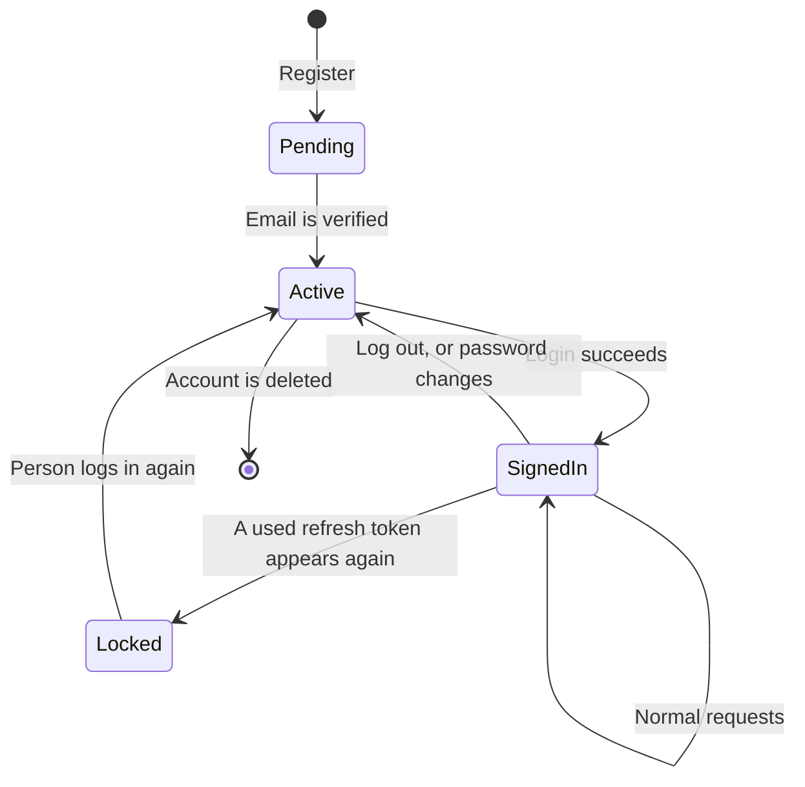
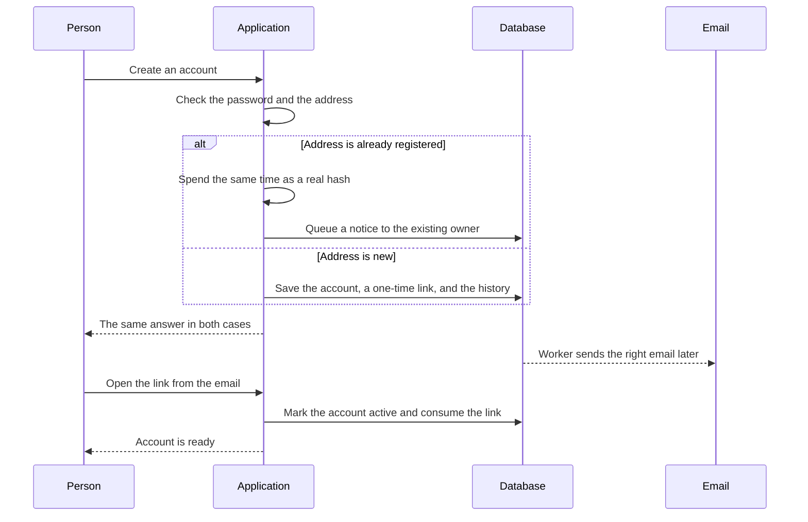
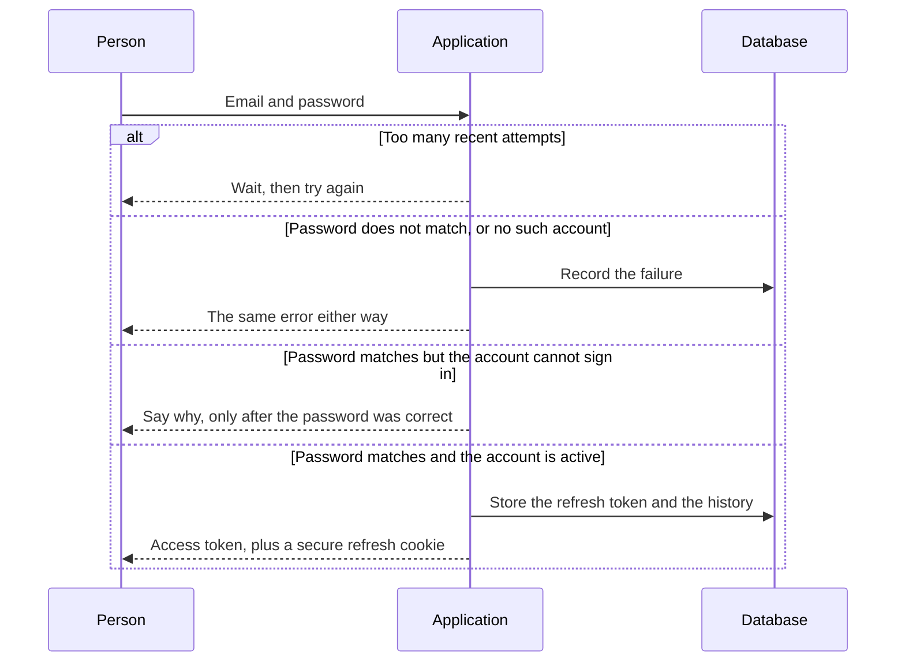
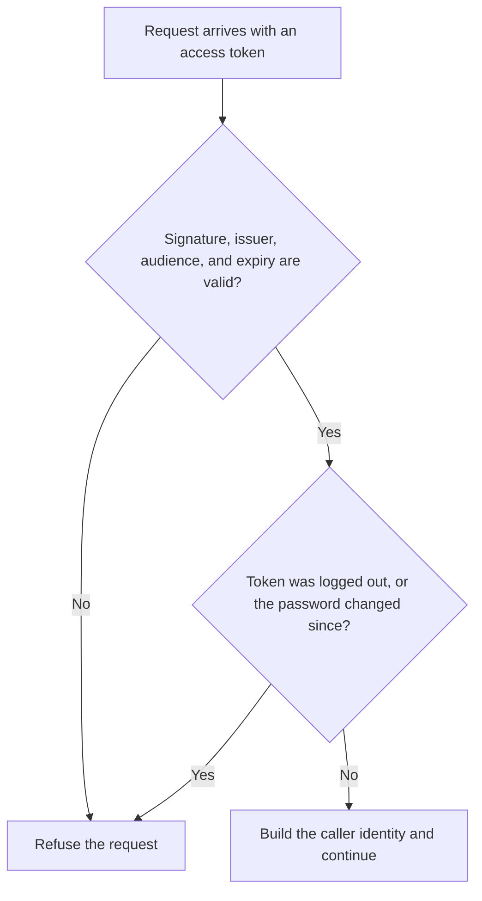
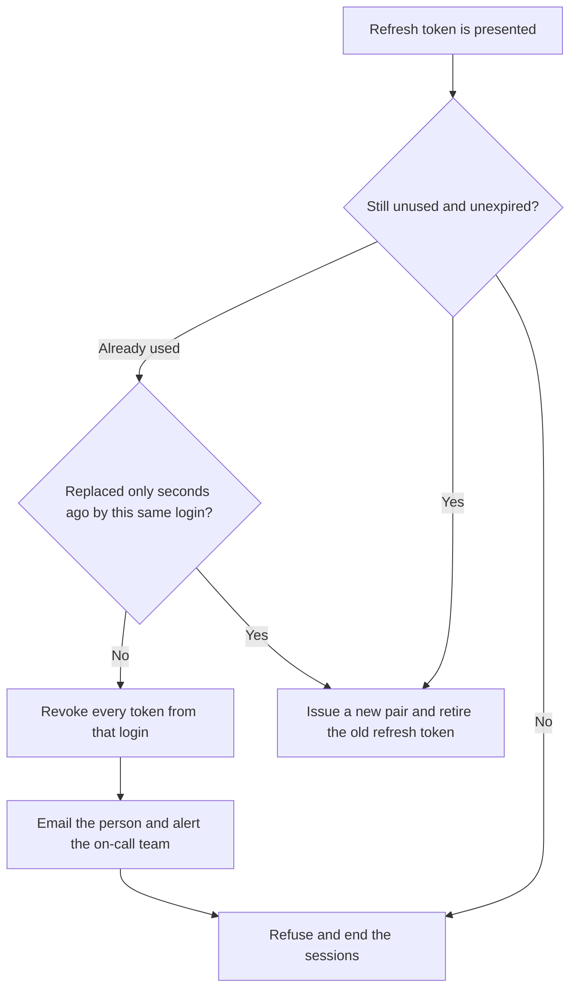
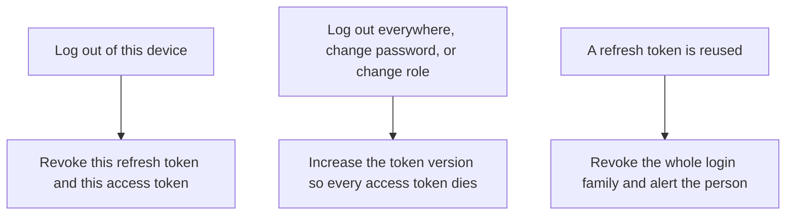

# Diagram 2 — Authentication Flow

Short forms are written out the first time they appear. The full list is in the [glossary](../GLOSSARY.md).

The complete token lifecycle: registration, login, authenticated access, rotation, reuse detection, and revocation. Detailed discussion in [System Design sections 1 to 3](../SYSTEM_DESIGN.md#1-user-registration) and [Security sections 3 to 4](../SECURITY.md#3-authentication).

---

## 2.1 Token Lifecycle — State View

The two transitions worth noticing are `Refreshing → Compromised` and the `token_version` path. The first is the mechanism that turns a stolen refresh token from a 30-day foothold into a detectable, self-revoking event. The second is how a single database write invalidates every outstanding access token for a user without enumerating a denylist.

---

## 2.2 Registration and Verification

---

## 2.3 Login

Note that **Argon2id verification happens outside the transaction**. It costs roughly 200 ms, and holding a database connection for that duration under a login burst is how a credential-stuffing attack becomes a connection-pool outage.

---

## 2.4 Authenticated Request — the Hot Path

The entire hot path is a signature verification plus two cached lookups. **No database round trip is required to authenticate**, which is the reason the access token is a JSON Web Token (JWT) at all.

---

## 2.5 Refresh with Reuse Detection

**Why the grace window exists.** A mobile client resuming with several queued requests can fire two refreshes concurrently and legitimately trigger reuse detection. Without the window, normal client behaviour would log users out. Ten seconds is short enough to be useless to an attacker — who has no reason to replay a token within seconds of the legitimate client — and long enough to absorb realistic races. It is a deliberate, bounded softening of the control rather than an unnoticed hole.

---

## 2.6 Revocation Paths

`token_version` is the mechanism that makes global revocation cheap. One integer increment invalidates every outstanding access token for a user, with no need to enumerate or store them — which is what allows the access token to remain stateless without giving up the ability to revoke.

---

**Related:** [System Design section 2 Authentication](../SYSTEM_DESIGN.md#2-authentication) · [System Design section 3 Token Refresh](../SYSTEM_DESIGN.md#3-token-refresh-with-reuse-detection) · [Security section 3 Authentication](../SECURITY.md#3-authentication) · [Security section 4 Token Revocation](../SECURITY.md#4-token-revocation)
