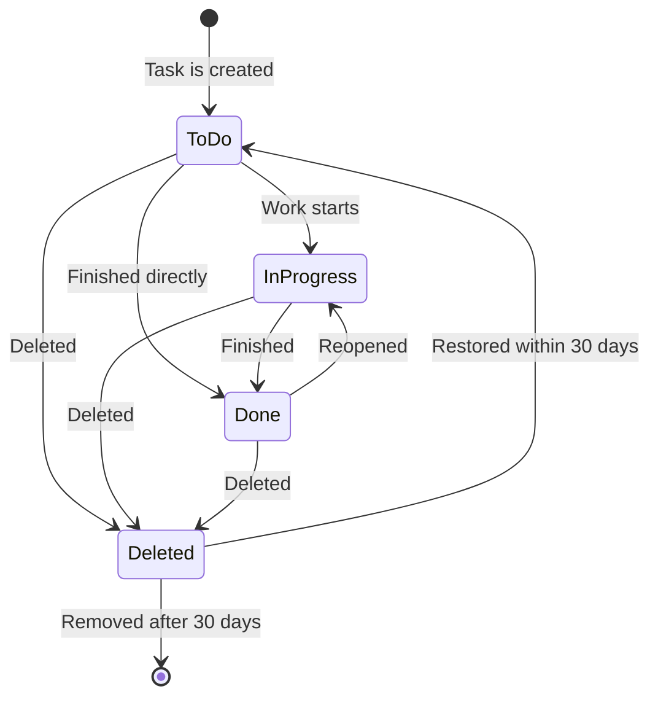
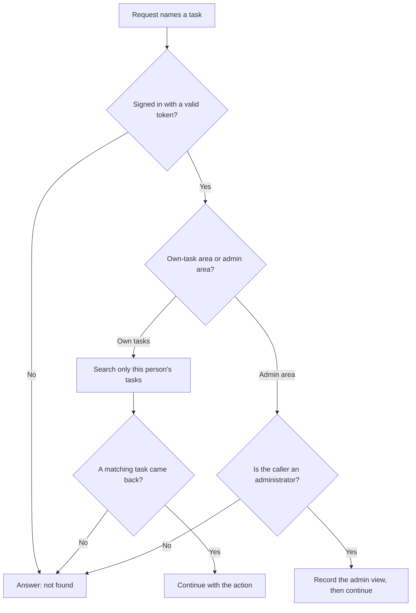
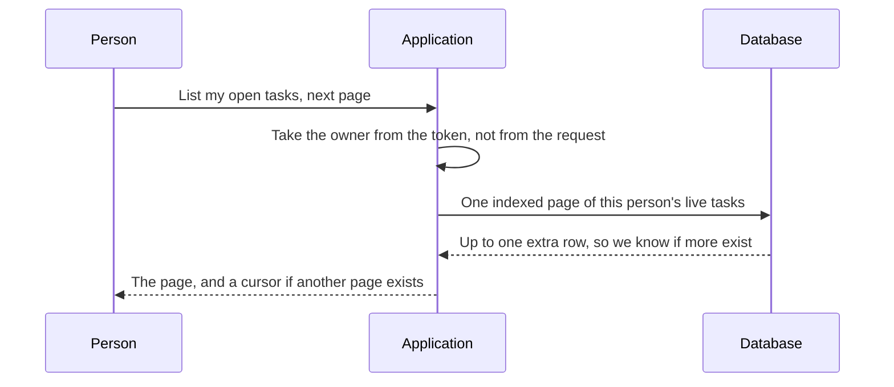
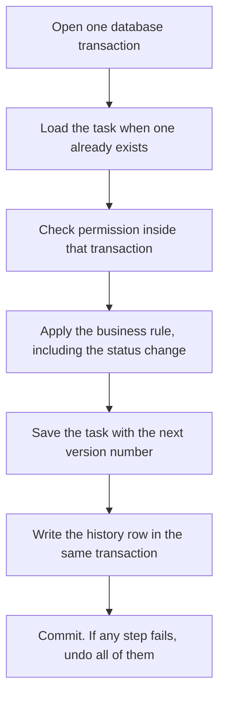
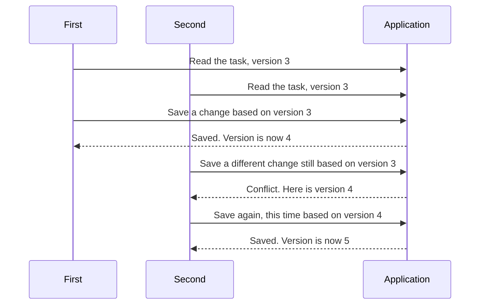
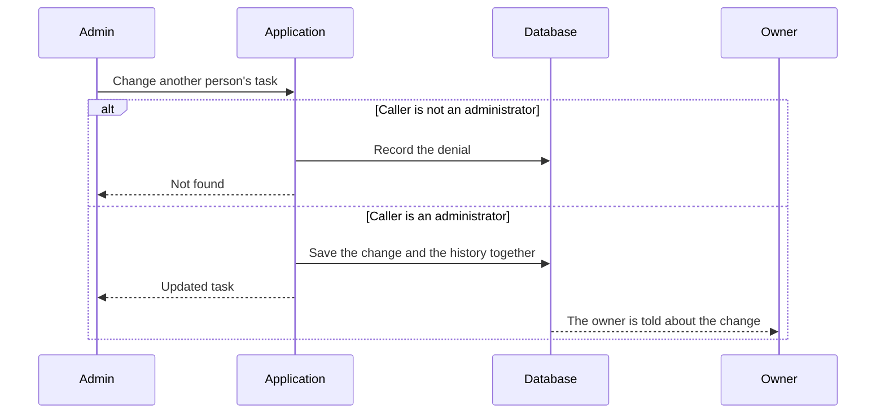
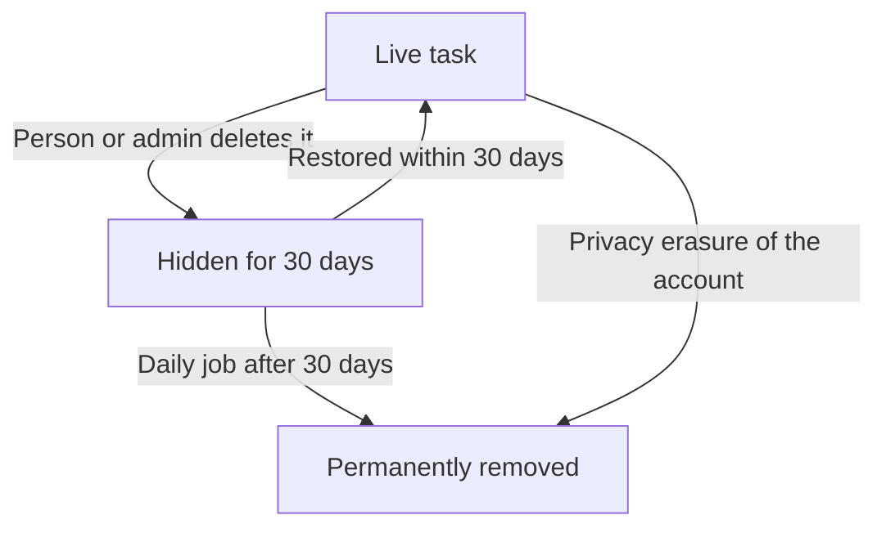

# Diagram 3 — Task Management Flow

Task lifecycle, the authorization decision, write-path transaction structure, and administrator cross-user access. Detailed discussion in [System Design sections 4 to 8](../SYSTEM_DESIGN.md#4-user-accessing-their-tasks).

---

## 3.1 Task Status State Machine

Every transition increments `version`, which is the value surfaced as the Hypertext Transfer Protocol (HTTP) `ETag`. The state machine lives in the domain entity, so it holds for every caller — HTTP handlers, background jobs, and future admin tooling alike.

---

## 3.2 The Authorization Decision

This is the single most important control in the system, so it is drawn on its own.

Three properties this diagram is meant to make obvious:

**The user path narrows at the query, before any check runs.** If someone later adds an endpoint and forgets to call `policy.authorize`, the query still returns nothing for another user's task. The system fails toward disclosing less.

**Both denial paths converge on `404`.** A `403` would confirm the resource exists and turn the endpoint into an existence oracle.

**The admin path audits reads.** In this domain the sensitive administrative action is usually looking, not changing.

---

## 3.3 List Own Tasks — Keyset Pagination

Two details carry real weight. The `SELECT` names its columns and **omits `description`**, so a 50-item list does not transfer hundreds of kilobytes and evict hot pages from the buffer cache. And `LIMIT 21` for a page of 20 determines `has_more` without a `COUNT(*)`, which on a large filtered set would be the most expensive part of the request.

---

## 3.4 Write Path — One Transaction

All three mutations share the same structure, which is the point of drawing them together.

The invariant every branch preserves: **the business mutation, its audit record, and any outbox event commit together or not at all.** There is no path by which a task changes without an audit row, and no path by which an event is published for a change that rolled back.

---

## 3.5 Concurrent Update — Why the Version Guard Exists

Without the version guard, Client B's write would silently overwrite Client A's completion. The user would mark a task done, watch it revert, and have no explanation. Optimistic concurrency turns that invisible data loss into an explicit `412` the client can resolve.

Pessimistic locking would also prevent it, at the cost of holding a database row lock across human think-time — converting a rare conflict into a common stall.

---

## 3.6 Administrator Cross-User Access

Note that the owner is **notified** when an administrator modifies their task. Silent administrative modification is how users lose trust in a system, and the notification costs one outbox row.

---

## 3.7 Delete, Restore and Purge

Soft delete and General Data Protection Regulation (GDPR) erasure are **deliberately different paths**. Soft delete serves user convenience and is reversible; erasure must be irreversible to satisfy a data-subject request. Conflating them is a common and expensive compliance mistake — a "deleted" record that is still queryable does not satisfy a right-to-erasure obligation.

The erasure job also pseudonymises the subject's identifier in the audit log rather than deleting the rows, preserving the integrity of a security control while removing the personal data.

---

**Related:** [System Design sections 4 to 8](../SYSTEM_DESIGN.md#4-user-accessing-their-tasks) · [Data Architecture section 6 Transaction Boundaries](../DATA_ARCHITECTURE.md#6-transaction-boundaries) · [application programming interface (API) Design section 5](../API_DESIGN.md#5-endpoint-detail)
