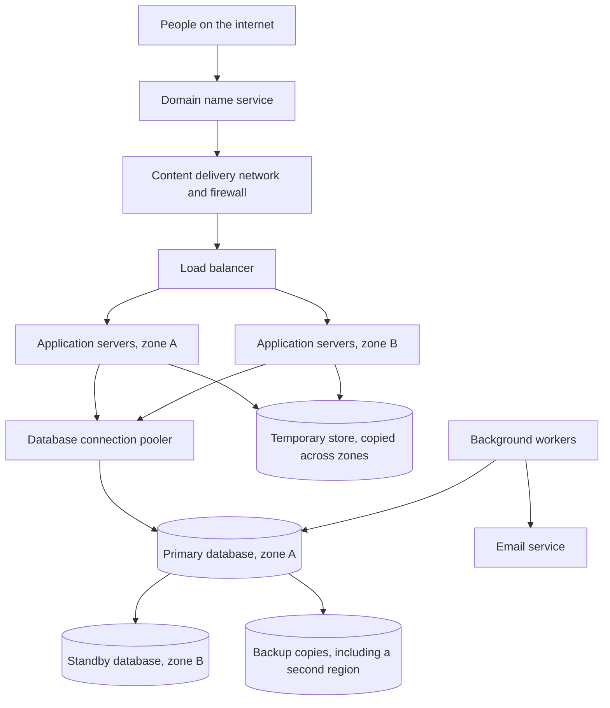
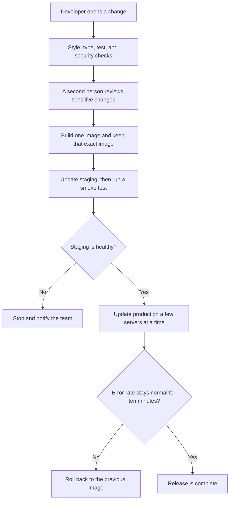

# Diagram 4 — Deployment & Infrastructure View

Physical topology, network segmentation, and the deployment pipeline. Reference implementation is Amazon Web Services (AWS); section 4.5 gives the equivalents on other providers. Discussion in [High-Level Design (HLD) section 11](../HLD.md#11-infrastructure-view).

---

## 4.1 Production Topology

---

## 4.2 Network Segmentation

Three tiers, each unable to reach further than it must. This is the control that limits blast radius when — not if — something in the application is compromised.

| Tier | Inbound | Outbound | Rationale |
|---|---|---|---|
| Public subnets | 443 from the internet, via web application firewall (WAF) only | To private app subnets | Only the load balancer is exposed |
| Private app subnets | From the Application Load Balancer (ALB) security group only | To data subnets, plus internet via Network Address Translation (NAT) | **No inbound internet route.** A compromised container cannot be reached directly |
| Private data subnets | 5432/6379 from the app security group only | **No internet route at all** | Even with credentials and code execution, data cannot be exfiltrated directly to the internet |

Security groups reference **other security groups, not CIDR ranges**, so rules stay correct as instances come and go — a CIDR-based rule silently grants access to whatever later occupies that address space.

virtual private cloud (VPC) endpoints keep traffic to S3, Secrets Manager, ECR and CloudWatch inside the AWS network, so it never traverses the NAT gateway or the public internet. That improves security posture and removes NAT data-transfer cost at the same time.

---

## 4.3 Deployment Pipeline

Three properties of this pipeline matter more than its shape:

**The same image digest is promoted from staging to production.** It is never rebuilt per environment. The artefact that passed the tests is bit-identical to the one released; only configuration differs.

**Migrations are a separate step, run before the application roll.** During a rolling deploy, old and new code execute simultaneously against the same schema, which is exactly why every migration must be backward compatible and why column removals span three releases ([Data Architecture section 10](../DATA_ARCHITECTURE.md#10-migrations)).

**Rollback never requires a database rollback.** Because migrations are expand-only within a release, reverting the application to the previous digest is always safe. A deployment strategy whose rollback path depends on reversing a migration is not a rollback path at all.

---

## 4.4 Environment Sizing

| | Local | CI | Staging | Production |
|---|---|---|---|---|
| Compute | Docker Compose | Ephemeral containers | 1 task, 0.5 vCPU | 2–10 tasks, 1 vCPU / 2 GB |
| Database | Container | Testcontainers | db.t4g.medium, single availability zone (AZ) | db.r6g.large, **Multi-AZ** |
| Redis | Container | Container | cache.t4g.micro | cache.r6g.large, Multi-AZ |
| Data | Seeded fixtures | Ephemeral | Anonymised subset | Real |
| Backups | None | None | Daily | **Daily + continuous write-ahead log (WAL)** |
| Access | Developer | Pipeline | Team | **Break-glass, audited** |

Staging deliberately runs the **same Terraform modules** as production with smaller instance parameters. Hand-built, divergent staging environments are why "it worked in staging" is a familiar sentence. The one intentional difference is single-AZ, since staging does not need to survive an AZ failure — and that difference is documented rather than incidental.

---

## 4.5 Provider Portability

The design uses commodity primitives, so the mapping to other providers is direct.

| Capability | AWS | Google Cloud Platform (GCP) | Azure | Self-hosted |
|---|---|---|---|---|
| Container runtime | Elastic Container Service (ECS) Fargate | Cloud Run | Container Apps | Nomad / K8s |
| Load balancer | ALB | Cloud Load Balancing | Application Gateway | HAProxy / Traefik |
| WAF | AWS WAF | Cloud Armor | Azure WAF | ModSecurity |
| PostgreSQL | Relational Database Service (RDS) Multi-AZ | Cloud Structured Query Language (SQL) HA | Database for PostgreSQL | Patroni |
| Redis | ElastiCache | Memorystore | Azure Cache | Redis Sentinel |
| Object storage | S3 | Cloud Storage | Blob Storage | MinIO |
| Secrets | Secrets Manager | Secret Manager | Key Vault | Vault |
| Registry | ECR | Artifact Registry | ACR | Harbor |
| Telemetry | CloudWatch + OTel | Cloud Ops + OTel | Monitor + OTel | Prometheus + Grafana + Tempo |

No proprietary programming or data model is embedded anywhere in the design — no Lambda-shaped handlers, no DynamoDB access patterns, no Cognito-specific token semantics.

Those are the choices that make a migration a rewrite rather than a redeployment. The remaining lock-in is operational — IaC, identity and access management (IAM) policies, runbooks — which is real work to change but is not architectural.

---

## 4.6 Cost Posture

Roughly \$700–900/month at the Stage 0 baseline, dominated by the Multi-AZ database and the always-on Fargate tasks.

Two of those costs are deliberate and I would not cut them: **Multi-AZ** is what makes the 60–120 second failover automatic rather than a manual, hour-long recovery, and **a minimum of two replicas across two availability zones (AZs)** is what makes a single instance failure invisible.

Running single-AZ would save meaningful money and would convert every routine maintenance event into an outage.

Where cost is managed instead: Fargate Spot for workers, which are interruption-tolerant by design; scale-to-minimum overnight; aggressive log sampling and metric-cardinality control, since observability spend can quietly exceed compute spend; S3 lifecycle rules moving archived audit partitions to infrequent-access and then to Glacier; and reserved capacity once usage is predictable.

---

**Related:** [HLD section 11 Infrastructure View](../HLD.md#11-infrastructure-view) · [HLD section 13 Environments](../HLD.md#13-environments-and-promotion) · [Availability section 2 single points of failure (SPOFs)](../AVAILABILITY.md#2-single-points-of-failure) · [Development Practices section 14 continuous integration and continuous delivery (CI/CD)](../DEVELOPMENT_PRACTICES.md#14-cicd)
